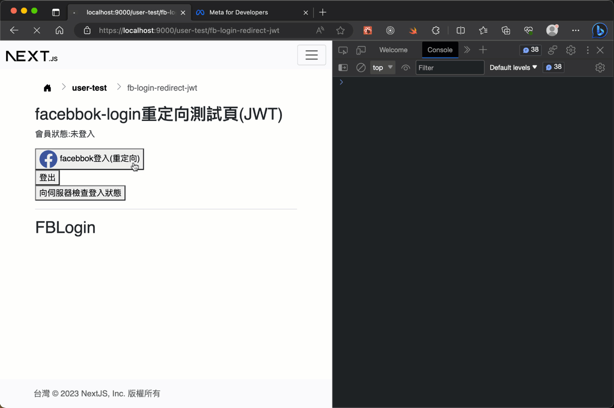

# Facebook 登入重定向(redirect)整合(透過firebase)

## 測試畫面



## 說明

## 預備知識 (!!重要必先了解!!)

1. 本地端測試環境要有`https`才能使用(在本機端產生ssl憑証)
2. !!!特別注意: 目前測試環境會受限，只有測試人員帳號才能登入測試，沒有加入測試人員帳號的facebook帳號無法登入測試
3. 2023/5/5後，Facebook(Meta)新規定只有通過[商家驗証(Business Verification)](https://developers.facebook.com/docs/development/release/business-verification)的開發者帳號，才能有進階存取(Advanced Access)的權限，這包含了登入時需要的 `email` 與 `public profile`權限
4. 這裡的實作是透過firebase中介認証，同一個email帳號不能同時用於facebook與google

### 為何要實作重定向(redirect)登入？

> 因為行動裝置(手機、平板)在實務上，"非常不適合"彈跳式的登入流程，常常會被擋住或失效。甚至在不同的電腦設備的瀏覽器設定，也有可能因安全性被阻擋跳出的窗口。

## 準備工作 (!!重要必先了解!!)

### 申請Facebook開發應用程式

> 注意: 本專案提供了開箱即用、已設定好的firebase + facebook應用設定，專案中使用的firebase設定值中已經可以作登入測試。如果對Facebook應用程式申請有疑問，請看下面補充說明或連絡Eddy。

#### 第1步 - 申請開發者帳號

先使用現成的或註冊一個新的Facebook帳號，到[Meta for Developers](https://developers.facebook.com/)申請開發人員帳號

#### 第2步 - 找到這個帳號的facebook id

登入到Facebook後，到大頭照頁面，找到瀏覽器上面的網址:

```text
https://www.facebook.com/photo/?fbid=10220961010989999&set=a.1488339482392
```

fbid後面就是你的facebook id，例如上面的網址中的fbid是`10220961010989999`

#### 第3步 - 加入測試人員帳號中

用Line連絡我(Eddy)，把`facebook id`傳給我，我會加到測試人員帳號中。加入後，連到[Meta for Developers](https://developers.facebook.com/)中的訊息裡要按下同意，這樣才算是正式加入。

之後測試看看，只有有加入的帳號才能進行這種登入。

### 開發環境 - ssl憑証 + next用

本實作採用[mkcert](https://github.com/FiloSottile/mkcert)應用，請依照其中說明安裝在電腦環境中:

macOS: (使用homebrew)

```sh
brew install mkcert
```

windows: (使用 [Chocolatey](https://chocolatey.org/))

```sh
choco install mkcert
```

安裝後，用命令列工具指令產生ssl憑証:

```sh
mkcert -install
mkcert localhost
```

之後會建立兩個檔案:`localhost-key.pem`與`localhost.pem`，把這兩個檔案放置在next的專案根目錄中。

### 前端(next)專案

安裝[local-ssl-proxy](https://github.com/cameronhunter/local-ssl-proxy)工具，這是要讓next能使用ssl憑証的proxy伺服器工具，它需要裝在全域中。
    
> 註:如果有遇到權限問題，macOS加上`sudo`，windows用管理者權限開啟命令列視窗):

```sh
npm install -g local-ssl-proxy
```

專案中安裝[npm-run-all](https://github.com/mysticatea/npm-run-all)，這是為了要一行npm指令，同時啟動next與local-ssl-proxy兩者用的，macOS和windows平台都可以使用:

```sh
npm install npm-run-all
```

修改`package.json`，加入`dev-ssl`啟動用的指令，在`"scripts"`區段:

> 註: `--source 9000`代表ssl會proxy在9000埠號中，3000是原本的next執行埠號。有需要可以調整。

```json
"scripts": {
    "dev-ssl": "run-p dev-ssl:*",
    "dev-ssl:local-ssl-proxy": "local-ssl-proxy --source 9000 --target 3000 --cert localhost.pem --key localhost-key.pem",
    "dev-ssl:next": "next dev"
  },
```

測試剛的安裝是否成功，在終端機中輸入:

```sh
npm run dev-ssl
```

用瀏覽器開啟網址的`https://localhost:9000`，看能不能正常看到原本的畫面，有的話代表上面安裝都成功了。

### 後端(express) - 套件

express要升級到`4.18.1`版本，這是為了要使用set-cookie的參數用的，參考最下面的補充說明章節:

`package.json`中像下面這樣，改express的版本，改好儲存後再執行一次`npm i`即可，如果你已經是用最新版本就不需要:

```json
"express": "4.18.1",
```


### 後端(express) - 資料庫

會員資料表裡加上`fb_uid`欄位，其它新增欄位與之前的google-login一樣，可以參考`data/users_xxxx.sql`的資料表結構或`data/firebase-facebook/users-table-fb-login-alter.sql`:

```sql
ALTER TABLE users
ADD COLUMN fb_uid VARCHAR(200) COMMENT '';
```

### 後端(express) - 路由

實作檔案在: `routes/facebook-login.js`，導入到`app.js`。和之前的google-login幾乎相同，差異部份見下面的補充章節。

## 實作

和[google-login-redirect](./docs/google-login-redirect.md)一樣，可以參考之前的文件。

## 補充說明

### 為什麼沒提供怎麼申請Facebook開發工具應用程式？

有幾個原因，主要目前Facebook(Meta)的新政策改變後，目前全新申請的開發應用程式，沒通過商家認証的人工審核的話，可能完全無法使用(連測試都不行)。這裡用的是新政策前申請的，目前還能測試使用，例只限於加入"測試人員帳號"的這種開發帳號而已。

第二，它申請的方式和設定，一直不斷有在調整中，網路上可以查到的版本有很多種，都要不斷的設定調整才能用，相當的不穩定，一個環節出問題就不能使用。這裡提供範例的都是有經過很多測試的作法，會少一些。

有需要可以參考整合的[圖解說明](https://menubar.io/firebase-facebook-login-react)和[圖解說明-中文](https://www.letswrite.tw/firebase-auth-google-fb/)。

### 有一種元件，是在畫面上有個"fb登入"的按鈕可以用嗎？

facebook的登入都需要開發者工具中的應用程式設定好，搭配才行。一樣會遇上剛說的商家認証問題。

### fb-login和google-login的差異？

因為`set-cookie`有預設`sameSite`安全機制，不能在ssl-proxy(即上述的`https://localhost:9000`)的瀏覽器設定cookie，所以需要額外加上選項`sameSite: 'none'`與`secure: true`。以下這是登入時用的程式碼:

> 註: express要[4.17.0版本](https://expressjs.com/en/changelog/4x.html#4.17.0)後才能設定這個選項，但最好是升級到最新版本

> 檔案: `routes/facebook-login.js`

```js
// 使用httpOnly cookie來讓瀏覽器端儲存access token
    res.cookie('accessToken', accessToken, {
      httpOnly: true,
      sameSite: 'none',
      secure: true,
    })
```

登出時選項要一致:

```js
router.post('/logout-ssl-proxy', authenticate, (req, res) => {
  // 清除cookie
  res.clearCookie('accessToken', {
    httpOnly: true,
    sameSite: 'none',
    secure: true,
  })

  res.json({ message: 'success', code: '200' })
})
```

假設你都要在ssl的proxy環境下運作的話，有可能也要調整一下其它的，可以參考上面的實作程式碼。