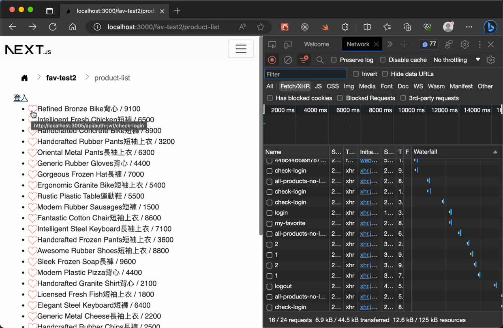
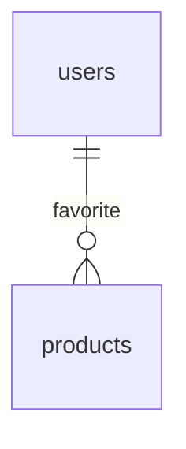
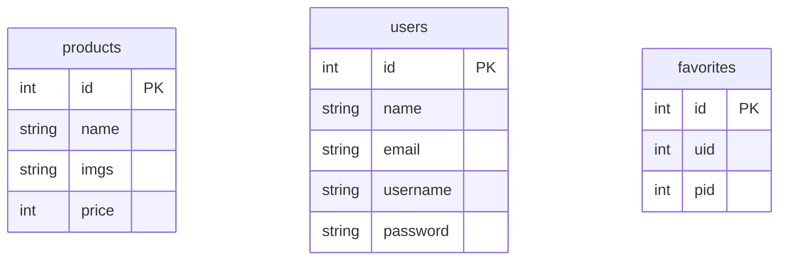
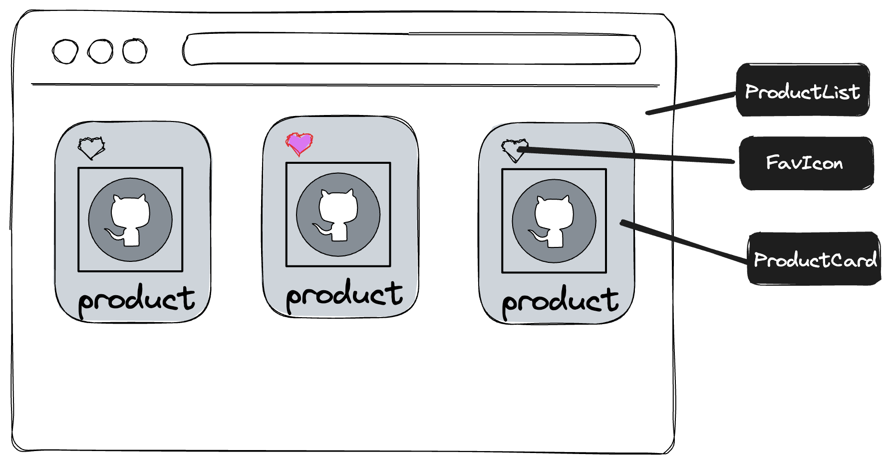

# 加入我的最愛(願望清單、書籤、待購清單…)範例

## 展示



## 說明

本例中以`users`(使用者)與`products`(商品)間的`favorites`(我的最愛)為實作與說明名稱，其它名稱的實作類似，例如文章與會員間的書籤關係等等。

## 實作範例之一

> 前端路由: `/fav-test/product-list`

前端(Next, React): 

- `pages/fav-test/product-list.js` 商品列表頁面元件
- `components/fav-test/product-card.js` 商品卡片元件(這裡為了簡化說明，起見只有用ul-li而已)
- `components/fav-test/fav-icon.js` 愛心圖示元件

後端(Node, Express):

- `routes/favorite.js` 範例api路由
- `app.js` 加入favorite路由

後端有一個可以協助建立範例資料表(products與favorites)的程式，請用node先直接執行:

> 注意: 記得不要用你目前的資料庫，或是先備份好users、products與favorites資料表再作測試

```sh
node ./utils/create-favorite-sample.js
```

或使用`data/favorite`資料夾中的sql建立範例用的資料表。

### 資料表與SQL設計(以MySQL為例)

因為它是`users`(使用者)與`products`(商品)間發生的一種關聯關係`favorites`(我的最愛)，實際上它可以說是`users`(使用者)與`products`(商品)產生關聯後的關聯資料表，資料表名稱可以是`user_product`或`product_user`，但通常都會以`favorites`來命名使用。

- 每個使用者會將"0個到多個"商品加入到我的最愛中，: user {1}–{0..n} product

> 注意:是0個到多個，favorite可以當動詞用，意思是"把…新增到收藏夾"



以下為資料表的簡單結構:



在SQL設計上，這資料表有四種查詢操作:

1. 列出(SELECT): 商品列表用，查詢目前使用者是否有加入某個商品到我的最愛
2. 列出(SELECT): 會員中心用，查詢目前使用者是否有加入某個商品到我的最愛，只列出有加入到我的最愛中的
3. 新增(INSERT): 使用者把某商品加入我的最愛
4. 刪除(DELETE): 使用者把某商品移出我的最愛

#### 第1項查詢: 列出(SELECT) 商品列表用

在第1項查詢的使用情況，是在商品清單要呈現在頁面時，需要依照目前使用者(需要已登入有是已登記在資料表中使用者或會員的情況)，呈現目前的情況，依照這個需求設計，它會和商品清單的查詢一併JOIN出來，例如:

```sql
-- uid為使用者id變數，會員登入後可以得到，需要代入查詢
SET @uid = 1;
-- 
SELECT p.*,
    f.id AS favorite_id
FROM products AS p
    LEFT JOIN favorites AS f ON f.pid = p.id
    AND f.uid = @uid
ORDER BY p.id ASC;
```

注意這裡要使用`LEFT JOIN`，因為並非所有商品都會被加到我的最愛中，所以會有空值(NULL)的情況，在最後查詢後會看到像下面的json資料，裡面有用到`NULL`值:

從MySQL查詢出的結果:

```js
[
  {
    id: 1,
    name: 'Handcrafted Frozen Bike長褲',
    price: 7500,
    img: 'https://loremflickr.com/640/480?lock=730801824071680',
    favorite_id: 8
  },
  {
    id: 2,
    name: 'Awesome Fresh Pants長袖上衣',
    price: 4700,
    img: 'https://picsum.photos/seed/7H4ZWZ/640/480',
    favorite_id: null
  }
]
```

用API路由GET後回應的JSON資料:

```json
{
  "products": [
    {
      "id": 1,
      "name": "Handcrafted Frozen Bike長褲",
      "price": 7500,
      "img": "https://loremflickr.com/640/480?lock=730801824071680",
      "favorite_id": 8
    },
    {
      "id": 2,
      "name": "Awesome Fresh Pants長袖上衣",
      "price": 4700,
      "img": "https://picsum.photos/seed/7H4ZWZ/640/480",
      "favorite_id": null
    },
  ]
}
```

簡單的實作當然不會要求這麼多，用`NULL`值或有`favorite_id`值時，在網頁上判斷要對應呈現空心或實心的愛心圖示不就行了，但實際上這個欄位值有問題，它的資料型態會變成是`NULL`值或`favorite_id`值其一，在對資料庫的資料型態很嚴格的系統中，這是一種不好處理的資料型態，這個值的最佳資料類型應該是布林值，因為是限定在兩種情況。

因此我們修改了一下之前的sql查詢，讓它先回傳一個布林字串(注意mysql中的布林值這種資料類型，一般常見會是用數字的1與0代表):

```sql
SELECT p.*, IF(f.id, 'true', 'false') AS is_favorite
    FROM products AS p
    LEFT JOIN favorites AS f ON f.pid = p.id
    AND f.uid = @uid
    ORDER BY p.id ASC;
```

在送出時我們改用了一個名稱為`is_favorite`的欄位名稱，代表這商品是不是目前使用者的我的最愛之一。

查詢出的結果(部份範例):

```js
[
  {
    id: 1,
    name: 'Handcrafted Frozen Bike長褲',
    price: 7500,
    img: 'https://loremflickr.com/640/480?lock=730801824071680',
    is_favorite: 'false'
  },
  {
    id: 2,
    name: 'Awesome Fresh Pants長袖上衣',
    price: 4700,
    img: 'https://picsum.photos/seed/7H4ZWZ/640/480',
    is_favorite: 'false'
  }
]
```

這裡有個小地方要注意，就是要回應API路由前，要轉為JSON格式要把`is_favorite`的字串值，轉為JSON中的布林值，用map方法很容易達成，這裡不作的話，到網頁上一樣得作這事，如下面的範例:

```js
const products = rows.map((v) => ({
    ...v,
    is_favorite: v.is_favorite === 'true',
  }))
```

用API路由GET後回應的JSON資料(部份範例):

```json
{
  "products": [
    {
      "id": 1,
      "name": "Handcrafted Frozen Bike長褲",
      "price": 7500,
      "img": "https://loremflickr.com/640/480?lock=730801824071680",
      "is_favorite": false
    },
    {
      "id": 2,
      "name": "Awesome Fresh Pants長袖上衣",
      "price": 4700,
      "img": "https://picsum.photos/seed/7H4ZWZ/640/480",
      "is_favorite": false
    }
  ]
}
```

相當理想的回應JSON檔，有了`is_favorite`這個布林值，在網頁上直接可以判斷看要呈現實心還空心圖示，這部份到後面的實作程式碼就會見到。

#### 第2項查詢: 列出(SELECT) 商品列表用(只需該會員的我的最愛商品)

第2個SQL查詢的實作，和第1個差不多。但它不需要像上面的`is_favorite`就是，因為要求只需要有加入到我的最愛的商品資料而已，把第1個查詢中的`LEFT JOIN`改為`INNER JOIN`就完成了，它大概是最簡單的一個，如下的SQL:

```sql
-- uid為使用者id變數，會員登入後可以得到，需要代入查詢
SET @uid = 1;
-- 
SELECT p.*
FROM products AS p
    INNER JOIN favorites AS f ON f.pid = p.id
    AND f.uid = @uid
ORDER BY p.id ASC;
```

#### 第3項查詢: 新增(INSERT): 使用者把某商品加入我的最愛

第3個查詢它也很簡單，因為我們的兩個uid(使用者id)與pid(商品id)是已知的情況，直接加入到`favorite`資料表就可以了:

```sql
-- uid為使用者id變數，會員登入後可以得到。pid是商品的id變數，需要代入查詢
SET @uid = 1;
SET @pid = 5;
-- 
INSERT INTO favorites (uid, pid)
VALUES (@uid, @pid)
```

#### 第4項查詢: 刪除(DELETE): 使用者把某商品移出我的最愛

因為我們有兩個uid(使用者id)與pid(商品id)是已知的情況。一樣很簡單範例如下:

```sql
-- uid為使用者id變數，會員登入後可以得到，需要代入查詢
SET @uid = 1;
SET @pid = 5;
-- 
DELETE FROM favorites
WHERE pid=@pid AND uid=@uid;
```

### REST API設計

商品清單的路由就只是GET資料:

> 注意: 目前這個API路由只能在會員要先登入後才能使用，後面章節會說明怎麼解決讓不是會員登入(訪客)時使用，如果你有需要可以另外針對訪客(非登入會員)設計另個api路由，這範例中並沒有實作這部份。

```http
GET /api/favorite/all-products
```

當使用者新增(或加入)一筆商品到我的最愛中時，在REST API的實作在方法(method)上的使用，是要使用`POST`或`PUT`，實際上都可以，但移出我的最愛都是用`DELETE`。以下是幾個目前在實務上的真實設計:

- Github中的[Starring(加入星星)](https://docs.github.com/en/rest/activity/starring?apiVersion=2022-11-28#star-a-repository)設計: PUT / DELETE
- 微軟的REST教學範例[Bookmarks](https://learn.microsoft.com/en-us/rest/api/securityinsights/stable/bookmarks): PUT / DELETE

這裡我們只是簡單的實作，設計對應的API路由使用下面的:

```http
PUT /api/favorite/:pid/:uid
DELETE /api/favorite/:pid/:uid
```

`uid`也可以來自伺服器中，經過middleware後，會得到uid， 這反而相對來說安全些，這個API路由本來的設計也只能會員才能作這件事，再簡化這個路由像下面這樣:

```http
PUT /api/favorite/:pid
DELETE /api/favorite/:pid
```

### 前端(Next, React)實作簡要說明


在前端實作時，需要一開始從`ProductList`元件向伺服器取得所有商品資料後，之後map每張商品卡片(`ProductCard`)，用屬性(props)傳入每單個商品的資訊，每個`ProductCard`裡會有個`FavIcon`元件，一樣接收到由父母元件傳遞的屬性(props)，在裡面決定圖示是要空心或實心，點按加入或移出資料表的程式碼，和伺服器相連的API路由的Fetch也會實作在`FavIcon`元件中。

元件的階層示意圖會像下面這樣:

```text
ProductList
└── ProductCard
     └── FavIcon
```




---

## 增進與改善: 實作範例之二

> 前端路由: `/fav-test2/product-list`

前端(Next, React): 

- `pages/fav-test2/product-list.js` 商品列表頁面元件
- `components/fav-test2/product-card.js` 商品卡片元件(這裡為了簡化說明，起見只有用ul-li而已)
- `components/fav-test2/fav-icon.js` 愛心圖示元件

另外在`hooks/use-auth-jwt.js`有也有增加和修改

後端(Node, Express):

- `routes/favorite.js` 範例api路由
- `app.js` 加入favorite路由

後端有一個可以協助建立範例資料表(products與favorites)的程式，請用node先直接執行:

> 注意: 記得不要用你目前的資料庫，或是先備份好users、products與favorites資料表再作測試

```sh
node ./utils/create-favorite-sample.js
```

或使用`data/favorite`資料夾中的sql建立範例用的資料表。

### 檢討&問題點

上面範例中的元件結構算是很簡單，所以它在實作時，只要符合流程，並不會有太多問題:

```text
按下愛心圖示 -> 伺服器作新增or刪除favorites中資料 -> 回應成功 -> 更動react中有關所有商品(products)的狀態 -> 頁面上重新渲染改變圖示
```

我們先了解有可能在真正實作上會出現什麼問題，再提供怎麼解決這些問題的建議。

第1個問題，是在稍微複雜的元件結構，假設說有了4層、5層或更多，愛心圖示元件(以這裡的`FavIcon`元件為例)，有可能在階層上，距離一開始從伺服器獲得資料的父母元件相當遠，在實作上需要一層一層傳遞id與處理函式，變得難以實作和容易出問題。

第2個問題，剛有說到了，在一開始與伺服器獲得資料的所有商品的狀態，這裡上面的實作它只能在會員登入時使用這個api路由，訪客(非登入)狀態不能直接用這api路由，當然是可以另外再寫一組專門給訪客的，與會員的區分開來沒錯。或是在api路由中的處理時判斷是會員還是非會員的情況，但這又是另個造成麻煩的地方，尤其是它們兩者的sql查詢有可能不太相同，太複雜的sql也容易出錯或需要花更多時間測試等等。

第3個問題，也是相當常見的，是所有商品的這個狀態(react中的`products`)，它有可能比這範例中也複雜得多，加上有許多來自不同資料表，或是有各種連帶的狀態都在裡面，例如分頁、排序、搜尋都會和它連動，它的物件結構的深度也並非是這麼簡單的兩層，就物件陣列結構而已，像我們的範例是長這樣:

```js
[
  {
    id: 1,
    name: 'Handcrafted Frozen Bike長褲',
    price: 7500,
    img: 'https://loremflickr.com/640/480?lock=730801824071680',
    is_favorite: 'false'
  },
  {
    id: 2,
    name: 'Awesome Fresh Pants長袖上衣',
    price: 4700,
    img: 'https://picsum.photos/seed/7H4ZWZ/640/480',
    is_favorite: 'false'
  }
]
```

但如果例如加上商品的評論、評分、選項、圖庫…等等，有可能物件結構階層很容易超過兩層。

超過兩層後，我們不能用像目前範例中的程式碼，簡單的處理在`products`狀態中的`is_favorite`更動，因為這個屬性有可能在更深層的地方，例如說第三或四層，或是更深的地方，這需要依靠像immer之類的專門處理狀態的工具函式庫來協助會比較容易實作和不易出錯。

### 我的最愛改以使用者(會員)為歸屬的設計

上面章節的範例實作並沒什麼問題，也運作得很好，也是因為它只是個很簡單的範例，沒考慮到什麼太多的複雜的東西，或是呈現的頁面、資料也簡單，但它可能和大專或實務上的應用可能有些不少的差異。

我們回到最初在"我的最愛"的設計來思考。在呈現商品列表時，"我的最愛"的確是商品資訊的其中一項。但換個角度思考，在會員資料中，它也能是這個會員的資訊中的一個種類，它會呈現0對多的關係，也就是說一個會員有可能會有0到多個商品項目，加入到他的"我的最愛"清單裡。

整體的應用情況是像這樣，當會員登入後，才會與愛心圖示的呈現有關，而訪客(非登入會員)的情況時，愛心圖示都是保持空心而且無法操作的，這是我們需要的設計。

所以，我們把有哪些商品加入到這個會員的"我的最愛"，讓它歸屬於這個會員的狀態中，而非和商品狀態歸屬在一起，這個實作一樣可以達成同樣的功能。

以上這個改變，只是從另個角度的實作而已，在最終功能上並不會有太大的差異，但它有可能改善或改進，目前在真正的實作上面臨到的潛在複雜問題(或你已經遇上的)。

另個想法是，一個會員能加入到我的最愛清單中的商品數量並不會太多，也可以限制它(例如最多100項，這設計上也很合理)。但一個網站上的商品資訊有可能非常多，數千上萬種商品，這角度的設計也很合理，或許商品的資訊已經太複雜了。

我們在會員的登入用的全站Context，在勾子中裡的狀態中，加入了一個`favorites`狀態，它代表了這個會員有加入到"我的最愛"的商品id清單:

> 前端: hooks/use-auth-jwt.js

```js
// 我的最愛清單使用
const [favorites, setFavorites] = useState([])
```

> 這裡有個問題出現: `為什麼不直接和auth(或authJWT)狀態中的userData，和會員的資料例如帳號、email等等在一起？`

答案是這樣，並不是說不能直接加入和其它的會員狀態放在一起，加在一起的實作一樣可行，只是會有其它的麻煩事出現。

會另外獨立是因為`auth`(或`authJWT`)中的`userData`是單純由會員資料表來的，會員登入後專用的資料，在目前的實作範例中，它在會員登入後，會進入到session或jwt的access token(存取令牌)中一起存放。

這機制的設計會讓新加入`favorites`顯得相當不搭配，尤其是`favorites`狀態，它的應用和其它會員資料並不相同，它也是一個會需要經常變動的狀態，會經常需要新增、刪除，代表你每次更新後，也要一併重新更新session或jwt的access token(存取令牌)，在實作上反而變得更麻煩了。

結論是`favorites`的確也是一個能歸屬於會員的狀態，但它並不合適與session或access token(存取令牌)有關聯到，它需要額外獨立出來處理較為方便。

而在真正的應用上，的確除非有必要性，我們不會在session或access token(存取令牌)中放入需要經常更新的資料。

> 註: 那你可能會想要問另個問題，會員本身的資料也會更新，是不是也最好別放在session或jwt的access token(存取令牌)中？這一點要視情況決定，太常會變動的資料當然是不好。會員的資料相較於我的最愛，並不是這麼容易地經常性更新的。目前的在範例中設計是，會員的資料放在session或access token(存取令牌)是能方便地，在伺服器端存取資料用，還是有它的必要性。在目前提供的範例並沒有區分到這麼細部。

原先商品中狀態的`is_favorite`不需要了，因為我們改由會員的`favorites`屬性來決定是否能操作愛心圖示，以及它的呈現，以下是單個商品的資料範例:

```js
{
    id: 1,
    name: 'Handcrafted Frozen Bike長褲',
    price: 7500,
    img: 'https://loremflickr.com/640/480?lock=730801824071680',
},
```

所以商品的sql與伺服器的實作，它不再需要透過會員認証的middleware。它就和原本不論是訪客或會員，都能看到商品資訊一樣而已，這部份使用你如果原本有的商品列表機制就行了，它也不需要什麼我的最愛的欄位，我的最愛的呈現將會不由商品的資料來決定。程式碼範例如下:

> 後端: routes/favorite.js

```js
router.get('/all-products-no-login', async (req, res, next) => {
  const sql = `SELECT p.*
    FROM products AS p
    ORDER BY p.id ASC`

  const { rows } = await executeQuery(sql)

  res.json({ products: rows })
})
```

需要新增的部份，在會員有登入情況時，有個api路由要能得到`favorites`狀態屬性的值，所以我們先寫出sql查詢來進行資料庫中的測試，它是個只有對`favorites`單一個資料表的查詢，得出的會是一個陣列值:

```sql
-- uid為使用者id變數，會員登入後可以得到，需要代入查詢
SET @uid = 1;
--
SELECT f.pid
FROM favorites AS f
    WHERE f.uid = @uid
ORDER BY f.pid ASC;
```

這個查詢將會在會員進行登入時作一次，以及重整頁面時也要觸發作一次，這裡設計了一個專門獲取的api路由給它:

```http
GET /api/favorite/my-favorite
```

它需要先有使用者id才能獲取資料，所以需要通過`authenticate`中介軟體後，可以得到`user.id`，因為本來就只有會員才能有我的最愛清單，它也與商品的api路由無關，實作出的api路由範例如下:

> 後端: routes/favorite.js

```js
// 獲得某會員id的有加入到我的最愛清單中的商品id們
router.get('/my-favorite', authenticate, async (req, res, next) => {
  const sql = `SELECT f.pid
        FROM favorites AS f
        WHERE f.uid = ${req.user.id}
        ORDER BY f.pid ASC;`

  const { rows } = await executeQuery(sql)
  // 將結果中的pid取出變為一個純資料的陣列
  const favorites = rows.map((v) => v.pid)

  res.json({ favorites })
})
```

最後我們在原本的`use-auth-jwt.js`，實作用於得到我的最愛的`getFavorites`函式，以及一個關聯於`authJWT.isAuth`用的`useEffect`，讓使用者登入後或重新檢查登入回來後的兩個時間點之後，都會設定`favorites`這個狀態，記得要把`favorites`與`setFavorites`一樣加到Context中，實作的範例如下:

> 前端: hooks/use-auth-jwt.js

```js
export const AuthProviderJWT = ({ children }) => {
  //...
  // 我的最愛清單使用
  const [favorites, setFavorites] = useState([])

  // 得到我的最愛
  const getFavorites = async () => {
    const res = await axios.get(
      'http://localhost:3005/api/favorite/my-favorite',
      {
        withCredentials: true,
      }
    )

    if (res.data.favorites) {
      setFavorites(res.data.favorites)
    }
  }

  useEffect(() => {
    if (authJWT.isAuth) {
      // 成功登入後要執行一次向伺服器取得我的最愛清單
      getFavorites()
    } else {
      // 登出時要設回空陣列
      setFavorites([])
    }
  }, [authJWT])

  //...

  return (
    <AuthContextJWT.Provider
      value={{
        authJWT,
        setAuthJWT,
        favorites, 
        setFavorites,
      }}
    >
      {children}
    </AuthContextJWT.Provider>
  )
```

原本的`product-list`程式碼改為以下的，這裡只有列出有修改的部份，因為`favorites`位於context中，它也可以像`authJWT`一樣使用`useAuthJWT`勾子可以得到:

```js
export default function ProductList() {
  //...
  const { favorites, setFavorites } = useAuthJWT()

  //...
  const handleTriggerFav = (id) => {
    // 在陣列中->移出，不在陣列中加入
    if (favorites.includes(id)) {
      setFavorites(favorites.filter((v) => v !== id))
    } else {
      setFavorites([...favorites, id])
    }
  }

  return (
    <ul>
      {/*...*/}
    </ul>
  )
}
```

`FavIcon`的程式和之前差不多，但會變成由`favorites`狀態來決定愛心圖示的空心或實心:

```js
export default function FavFcon({ is_favorite, handleTriggerFav, id }) {
  // 由context取得authJWT-判斷是否能執行add或remove用，favorites決定愛心圖案用
  const { authJWT, favorites } = useAuthJWT()

  const addFavToServer = async (pid) => {
    const res = await axios.put(
      `http://localhost:3005/api/favorite/${pid}`,
      {}, // put 第二參數是data，這裡雖然不需要，但還是要加上空物件
      {
        withCredentials: true,
      }
    )

    if (res.data.message === 'success') {
      // 伺服器成功後，更新context中favorites的狀態，頁面上的圖示才會對應更動
      handleTriggerFav(pid)
    }
  }

  const removeFavToServer = async (pid) => {
    const res = await axios.delete(
      `http://localhost:3005/api/favorite/${pid}`,
      {
        withCredentials: true,
      }
    )

    if (res.data.message === 'success') {
      // 伺服器成功後，更新context中favorites的狀態，頁面上的圖示才會對應更動
      handleTriggerFav(pid)
    }
  }

  return (
    <>
      {/* 由favorites狀態決定呈現實心or空心愛愛圖示 */}
      {favorites.includes(id) ? (
        <button
          style={{ padding: 0, border: 'none', background: 'none' }}
          onClick={() => {
            // 沒登入不能用
            if (!authJWT.isAuth) return alert('會員才能使用!')

            removeFavToServer(id)
          }}
        >
          <Heart />
        </button>
      ) : (
        <button
          style={{ padding: 0, border: 'none', background: 'none' }}
          onClick={() => {
            // 沒登入不能用
            if (!authJWT.isAuth) return alert('會員才能使用!')

            addFavToServer(id)
          }}
        >
          <Heart color="white" />
        </button>
      )}
    </>
  )
}
```

### 結論 - 改變了什麼

我們經過這增進改善，和原本的作法差異在哪裡，功能都是一樣的，這有所謂的`增進改善`在什麼地方？

我們先回到剛說的三個問題，我把它摘要和回答如下:

> 第1個問題: 在複雜的元件結構或階層時，愛心圖示(FavIcon)離父母元件商品列表(ProductList)太遠，更新狀態變得不容易實作或容易出錯

這問題稱為屬性鑽孔取探(props drilling)問題，它是react中的一種反樣式，在元件階層太深或距離太遠時，都有可能會產生這種不好的樣式。

新的改進後，因為是`favorites`位於context中，是一種共享的狀態，都可以很容易在需要的元件中獲取這個全站共享狀態，已解決這種反樣式的問題。也就是說不論階層有多深或距離多遠，都大幅減少了這種不易實作的情況。

> 第2個問題: 與伺服器獲得資料的所有商品的狀態，需要另外針對訪客(非登入)與會員的區分開實作

新的改進後，已經沒這問題，商品資料就不用考慮這個，一個對商品列表獲得的api路由或實作就可以通用了。我的最愛的呈現或該怎麼操作，並不是由向伺服器獲得所有商品資料時所決定的，而是由訪客(非登入)或會員已登入時，在context中的`favorites`狀態決定的。

> 第3個問題，所有商品的狀態(react中的`products`)物件結構的深度和階層很多時，不容易針對單一個我的最愛作更新

新的改進後，和第2個問題一樣，也已經不會有這問題。因為我的最愛這個狀態並不在`products`狀態中，它有獨立的在context中的`favorites`狀態，而且只是個裝入商品id的一層陣列，在狀態的處理上很簡單，像下面這樣程式碼這樣。未來不論你的商品狀態`products`有多複雜或再多層級，也和這"我的最愛"無關。

```js
const handleTriggerFav = (id) => {
    // 在陣列中->移出，不在陣列中加入
    if (favorites.includes(id)) {
      setFavorites(favorites.filter((v) => v !== id))
    } else {
      setFavorites([...favorites, id])
    }
  }
```

