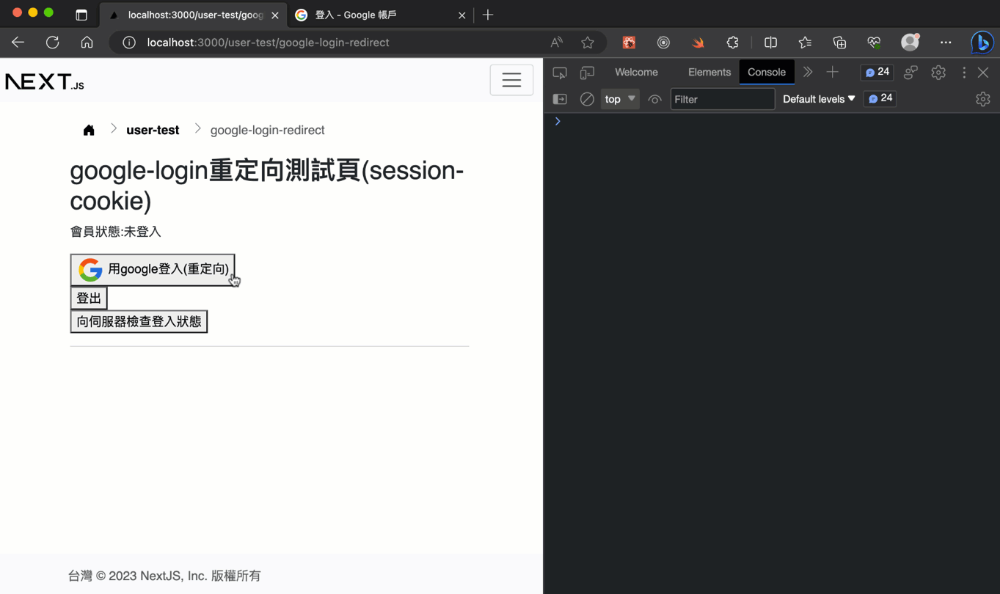

# Google 登入重定向(redirect)整合(透過firebase)

## 測試畫面



## 說明

### 為何要改實作重定向(redirect)登入？

> 因為行動裝置(手機、平板)在實務上，"非常不適合"彈跳式的登入流程，常常會被擋住或失效。甚至在不同的電腦設備的瀏覽器設定，也有可能因安全性被阻擋跳出的窗口。

### 程式範例

1. firebase的重定向登入機制是: `你網站的登入頁按下登入按鈕 -> 連到google登入頁後 -> 使用者登入完成後 -> 回調(callback)到同一網址(你網站的登入頁)回來`
2. 程式碼範例在`next-bs5`專案中的[pages/user-test/google-login-redirect.js](https://github.com/mfee-react/next-bs5/blob/main/pages/user-test/google-login-redirect.js)與[hooks/use-firebase.js](https://github.com/mfee-react/next-bs5/blob/main/hooks/use-firebase.js)目前只有實作session-cookie這種，jwt修改一下就能用了。
3. 後端(node, express伺服器端)登入機制和之前的[google-login](./google-login.md)一樣

### 程式碼解說

登入時要改用`loginGoogleRedirect`方法，它的程式碼很簡單，也不處理登入後的流程:

> 檔案: `hooks/use-firebase.js`

```js
const loginGoogleRedirect = async (callback) => {
  const provider = new GoogleAuthProvider()
  const auth = getAuth()
  signInWithRedirect(auth, provider)
}
```

登入後的流程要改為同頁面的一個事件監聽方式，利用firebase模組中的一個`onAuthStateChanged`，監聽目前這個頁面的登入狀態，實作如下:

> 註: 另個`getRedirectResult`在這裡沒用到，只是作為比對用，這方法只會在作登入流程時，又回到這頁面被呼叫。

```js
// 重定向專用，用於在同頁面(firebase的登入頁會與回調頁同一頁)監聽登入情況
// getRedirectResult回調頁時用(註:重定向後，回調回來時才會呼叫)
// onAuthStateChanged監聽auth物件變化 <---(用這個就足夠，它會在頁面一啟動偵測目前登入情況)
const initApp = (callback) => {
  const auth = getAuth()

  // Result from Redirect auth flow.
  getRedirectResult(auth)
    .then((result) => {
      // This gives you a Google Access Token. You can use it to access Google APIs.
      const credential = GoogleAuthProvider.credentialFromResult(result)
      const token = credential.accessToken

      // The signed-in user info.
      const user = result.user
      console.log(token)
      console.log(user)
    })
    .catch((error) => {
      console.error(error)
    })

  // Listening for auth state changes.
  onAuthStateChanged(auth, (user) => {
    console.log('user', user)
    // callback the user data
    callback(user.providerData[0])
  })
}
```

因為多了這個事件監聽機制，所以在登入頁需要在初次渲染時執行加入:

> 檔案: `pages/user-test/google-login-redirect.js`

```js
// 這裡要設定initApp，讓這個頁面能監聽firebase的google登入狀態
useEffect(() => {
  initApp(callbackGoogleLoginRedirect)
}, [])
```

由於它是一個監聽動作，一進入這個頁面，詢問到firebase，當有改變firebase-google的登入狀態就會觸發，和之前的彈跳登入不太一樣。

這裡額外在`callbackGoogleLoginRedirect`函式中，一開始先擋住，如果正在登入時，別再作多餘的登入動作(註: 以免使用者已經登入了，又連到這個頁面會又要作重新登入動作，可能會造成不預期情況):

```js
const callbackGoogleLoginRedirect = async (providerData) => {
    // 如果目前react(next)已經登入中，不需要再作登入動作
    if (auth.isAuth) return
    // ...
}
```
