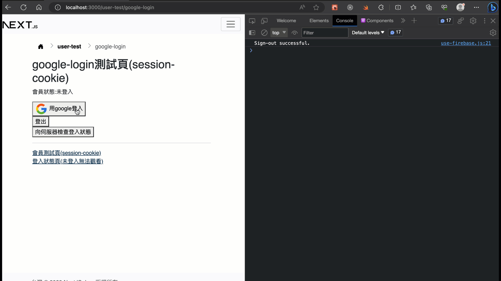

# Google 登入整合(透過firebase)

## 測試畫面



## 準備工作

### 申請firebase專案api key步驟

> 註: 有google(gmail)帳號就能申請firebase帳號。不過，`next-bs5`的`hooks/firebase-config.js`中有開箱內建，我已經申請的api key了，但它是免費的帳號，只能用於`localhost`，每日有上限100限制，建議還是用自己的gmail帳號，申請firebase帳號就能申請自己的，按下面的圖解或影片申請是很容易的。

- [圖解](https://github.com/orgs/mfee-react/discussions/65#discussioncomment-5074321)
- [影片](https://www.youtube.com/watch?v=FoLNfMydMXw)

申請好填入next前端的`hooks/firebase-config.js`。

> 註: firebase的api key可以用於前端，沒有安全性的問題。參考[Is it safe to expose Firebase apiKey to the public?](https://stackoverflow.com/questions/37482366/is-it-safe-to-expose-firebase-apikey-to-the-public)

### 伺服器端-資料庫

需要以下四個欄位(擴充原本的會員登入用的欄位，如果已有就不用新增): `name`,`email`,`google_uid`,`photo_url`。如果不想要用這四個名稱，可以在`routes/google-login.js`裡改這名稱。

這四個欄位的用途是當使用者利用google登入後，將google回傳的資料儲存到資料庫。

注意: 因為使用者是利用google登入，所以這種使用者不會有`username`與`password`欄位的值，請確認你的會員資料表這兩個欄位允許為NULL(空值)，或預設為NULL。

> 以下範例的會員資料表名稱為`users`，可以改成你自己的。

```sql
-- name for providerData.displayName
ALTER TABLE users
ADD COLUMN name VARCHAR(200) COMMENT '';
-- email for providerData.email
ALTER TABLE users
ADD COLUMN email VARCHAR(200) COMMENT '';
-- google_uid for providerData.uid
ALTER TABLE users
ADD COLUMN google_uid VARCHAR(200) COMMENT '';
-- photo_url for providerData.photoURL
ALTER TABLE users
ADD COLUMN photo_url VARCHAR(200) COMMENT '';
```

### next(react)前端-安裝套件

```sh
npm i firebase
```

## 測試

`express-base-esm`後端目前的實作範例:(同一支程式碼檔案`routes/google-login.js`)

- 整合session-cookie: `http://localhost:3005/api/google-login/session`
- 整合jwt:`http://localhost:3005/api/google-login/jwt`

> 註: 可以先用postman測通後端api路由，post下面這個json資料範例

```json
{
    "providerData": {
        "providerId": "google.com",
        "uid": "100000685961710971999",
        "displayName": "xxx",
        "email": "xxx@gmail.com",
        "phoneNumber": null,
        "photoURL": "https://lh3.googleusercontent.com/a/xxxxxx"
    }
}
```

`next-bs5`前端目前的實作範例:

- 整合session-cookie: `http://localhost:3000/user-test/google-login` 
- 整合jwt:`http://localhost:3000/user-test/google-login-jwt`

註: 因為它會需要搭配`useAuth`或`useAuthJWT`使用，所以請按之前的[session-cookie](./session-cookie.md)文件與[JWT](./jwt.md)設定好`AuthProvider`或`AuthProviderJWT`在`_app.js`中，不然會發生錯誤。

## 備註

1. 由firebase google功能成功login後，得到的整個回傳的: [json範例](../data/firebase-google/return-user-sample.json)
2. 注意，用此方式在登出時，並不會登出google帳號，而是登出在firebase中的帳號(實際上使用者登入後，會在firebase中建立一個帳號，是登出這個firebase帳號)