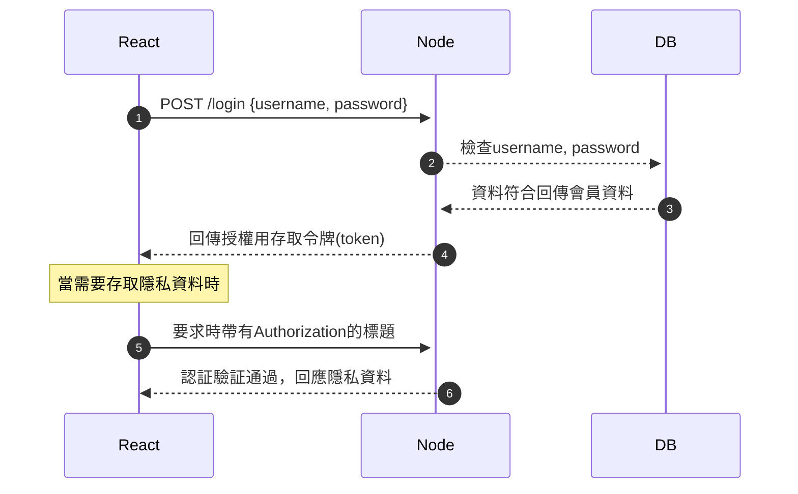

# 會員登入解說 - JWT

## JWT

JWT(JSON Web Token)是一種目前流行的客戶端(瀏覽器、應用程式)與伺服器端進行認証與授權的作法。

JWT的內容詳細介紹並非本文的重點，本文主要在實作這個功能。如果同學對JWT並不熟悉，可以參考以下的文章說明:

- [JSON Web Token](https://en.wikipedia.org/wiki/JSON_Web_Token) 維基百科(英文)
- [淺談 Session 與 JWT 差異](https://medium.com/@jedy05097952/%E6%B7%BA%E8%AB%87-session-%E8%88%87-jwt-%E5%B7%AE%E7%95%B0-8d00b2396115)

JWT的token(令牌，通常被稱為access token)是以公開/私有密鑰的加密演算來進行相關驗証，所以藉著這個通行証或令牌，作為一種授權(Authorization)時的運用機制，也就是當客戶端需要要求隱私或保護資料時，需要一開始登入後認証(Authentication)完成後，由伺服器端發給的一個令牌，之後加在對敏感性(或隱私性)資料的要求標頭中一併要求才行，伺服器端會對這令牌，進行驗証才會回應這些敏感性(或隱私性)資料。

> 註: 如果要說明專有名詞更佳清楚的話。認証(Authentication)指的是登入認証的機制，例如輸入帳號密碼後登入。授權(Authorization)指的是存取保護或隱私資料的機制。

它的運作大致上的時序圖如下:



JWT常對比的是Session授權機制，它們之間有許多不同之處，優劣點的比較涉及到較進階的議題，不在這裡說明。以下只是簡單地說明與這篇實作上的有關的:

Session-cookie是一種開箱即用的授權機制，它是很典型與早期(1997)就有的標準[RFC 2109](https://datatracker.ietf.org/doc/html/rfc2109)。Session-cookie相當容易實作，並非使用了JWT或其它授權機制可以完全取代它，這可能是個誤導，在許多搭配的不同認証或授權機制一樣要利用它。

而JWT是後來(2010)才有的授權機制，主要是為了因應各種網路上現代的客戶端與伺服端的應用，發展出來的另一種授權機制[RFC 7519](https://datatracker.ietf.org/doc/html/rfc7519)。JWT需要額外的核發令牌與驗証機制加入到，它在真正實務上用的方式有可能會很複雜，也並不容易實作(例如常見的雙令牌機制)，而且要看伺服器應用的情況決定(資料庫、其它第三方認証整合…等等)。

Session儲存於伺服器中，也有各種儲存方式，可以存在記憶體、檔案、資料庫中。用於比對認証的cookie中只有對應的SESSION_ID而已，它並沒有資料在裡面。當然因為有這需要儲存的需求，伺服器需要有額外的配置來儲存這些資料。

相較之下，JWT的令牌(與簽章, signature)是儲存在客戶端，但並沒有限制說只能儲存在哪裡，以瀏覽器為客戶端，常見的教學中的實作是儲存在local storage(或session storage)，不過它也可以儲存在cookie，或是以react應用來說，可以存在react的狀態(state)中，但狀態(state)只是一個暫存的記憶體，重新刷新網頁或重新連接時就會消失。不同的儲存處有各自的安全性上的問題，實作的方式也會有差異處。

> 特別注意: 將JWT存在local storage(或session storage)是一個可能有嚴重安全性問題的作法，雖然有很多文章或影片教學都這樣教你。local storage(或session storage)不合適儲存各種敏感性資料(個資、JWT認証資料…等等)。參考這裡的文章說明[Please Stop Using Local Storage](https://www.rdegges.com/2018/please-stop-using-local-storage/)。安全的方式是儲在[HttpOnly cookie](https://developer.mozilla.org/zh-TW/docs/Web/HTTP/Cookies#secure_%E4%BB%A5%E5%8F%8A_httponly_cookies)。

最後，JWT的技術由上面的文章大致了解，它和session的目的和應用實際上並不衝突，所以都可以獨立與搭配應用的技術。以下為實作的部份，它會由前一篇的[session-cookie](./session-cookie.md)實作延伸而來。

## express實作

首先的準備工作之一，要在express專案中安裝[jsonwebtoken](https://www.npmjs.com/package/jsonwebtoken)套件，這個套件提供了以下的API:

- jwt.sign 簽署簽名、核發令牌使用
- jwt.verify 驗証令牌使用(它也有解碼的回調用途)

另外要設定一組夠安全的伺服器端字串，在`.env`檔案中設定:

> .env

```text
ACCESS_TOKEN_SECRET=thisisverstrongaccesstokensecre
```

在會員進行登入認証時，如果認証通過(資料庫帳號密碼符合後)，就核發簽名與存取令牌回傳到客戶端，實作的程式碼如下:

> 註: 本範例使用httpOnly的cookie的較為安全的作法，並不是使用local storage(或session storage)來儲存JWT

> routes/auth-jwt.js

```js
import jsonwebtoken from 'jsonwebtoken'
// 存取`.env`設定檔案使用
import 'dotenv/config.js'
// 定義安全的私鑰字串
const accessTokenSecret = process.env.ACCESS_TOKEN_SECRET
// ...

router.post('/login', async (req, res) => {
  // 從要求的req.body獲取username與password
  const { username, password } = req.body

  // 先查詢資料庫是否有同username/password的資料
  const isMember = await verifyUser({
    username,
    password,
  })

  if (!isMember) {
    return res.json({ message: 'fail', code: '400' })
  }

  // 會員存在，將會員的資料取出
  const member = await getUser({
    username,
    password,
  })

  // 如果沒必要，member的password資料不應該，也不需要回應給瀏覽器
  delete member.password

  // 產生存取令牌(access token)，其中包含會員資料
  const accessToken = jsonwebtoken.sign({ ...member }, accessTokenSecret, {
    expiresIn: '24h',
  })

  // 使用httpOnly cookie來讓瀏覽器端儲存access token
  res.cookie('accessToken', accessToken, { httpOnly: true })

  // 傳送access token回應(react可以儲存在state中使用)
  res.json({
    accessToken,
  })
})
```

登出時，作清除cookie的動作:

```js
router.post('/logout', authenticate, (req, res) => {
  // 清除cookie
  res.clearCookie('accessToken', { httpOnly: true })

  res.json({ message: 'Logout successful' })
})
```

當需要存取敏感性(隱私)資料時，使用下面的程式碼作為驗証:

```js
// 檢查登入用 
router.get('/check-login', authenticate, (req, res) => {
  const user = req.user
  return res.json({ message: 'authorized', user })
})

```

> middlewares/jwt.js

```js
import jsonwebtoken from 'jsonwebtoken'

// 存取`.env`設定檔案使用
import 'dotenv/config.js'

// 獲得加密用字串
const accessTokenSecret = process.env.ACCESS_TOKEN_SECRET

// 中介軟體middleware，用於檢查是否在認証情況下
export default function authenticate(req, res, next) {
  //const token = req.headers['authorization']
  const token = req.cookies.accessToken
  console.log(token)

  // if no token
  if (!token) {
    return res.status(403).json({ message: 'Forbidden' })
  }

  if (token) {
    // verify的callback會帶有decoded payload(解密後的有效資料)就是user的資料
    jsonwebtoken.verify(token, accessTokenSecret, (err, user) => {
      if (err) {
        return res.status(403).json({ message: 'Forbidden' })
      }

      // 將user資料加到req中
      req.user = user
      next()
    })
  } else {
    return res.status(401).json({ message: 'Unauthorized' })
  }
}

```

> 註: 其它express的實作部份參考[session-cookie](./session-cookie.md)實作的說明，例如cors或cookie的設定不在這裡重覆說明

### Next(react, 瀏覽器)在重新連接網頁時、會員登出入的對應應用

在Next(react, 瀏覽器)端有一個簡單的`parseJwt`函式，用於解析出在從伺服器回應的access token中帶有的會員資料使用:

> pages/user-test/jwt.js

```js
function parseJwt(token) {
    const base64Payload = token.split('.')[1]
    const payload = Buffer.from(base64Payload, 'base64')
    return JSON.parse(payload.toString())
  }
```

我們一樣可以實作出一個專門用於JWT的useAuth勾子，也是為了要在重新整理或重新連上網頁時，向伺服器進行重新的認証用，實作的內容如下(它除了名稱改了一下之外，與之前在[session-cookie](./session-cookie.md)實作並沒差太多):


- 程式碼在: [hooks/use-auth-jwt.js](https://github.com/mfee-react/next-bs5/blob/main/hooks/use-auth-jwt.js)

`AuthProviderJWT`這個Context一樣要加到`_app.js`中，如果怕會和`AuthProvider`衝突可以先註解掉它。

```js
import { AuthProviderJWT } from '@/hooks/use-auth-jwt'
// ...
export default function MyApp({ Component, pageProps }) {
 //...
  return (
    return (
    <AuthProviderJWT>
      {/* <AuthProvider> */}
      <CartProvider>{getLayout(<Component {...pageProps} />)}</CartProvider>
      {/* </AuthProvider> */}
    </AuthProviderJWT>
  )
  )
}
```

其它測試的實作請參考:

- [pages/user-test/jwt.js](https://github.com/mfee-react/next-bs5/blob/main/pages/user-test/jwt.js)
- [pages/user-test/login-status-jwt.js](https://github.com/mfee-react/next-bs5/blob/main/pages/user-test/login-status-jwt.js)