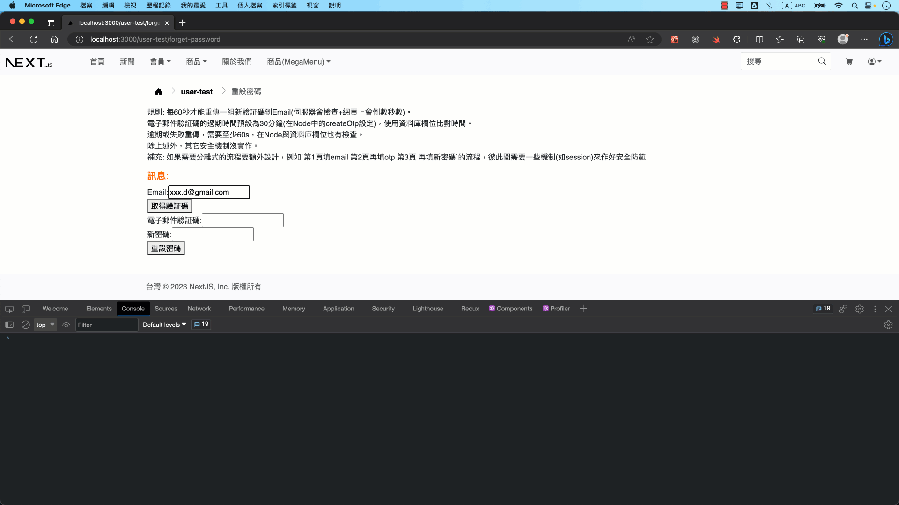
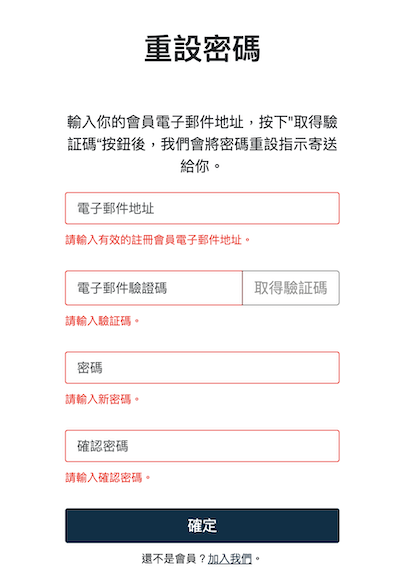
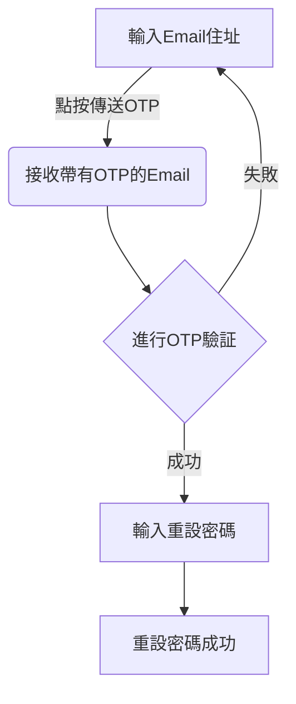
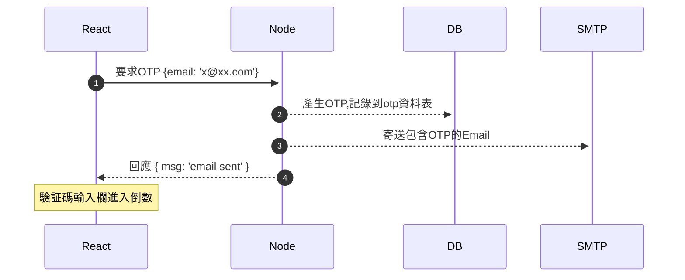
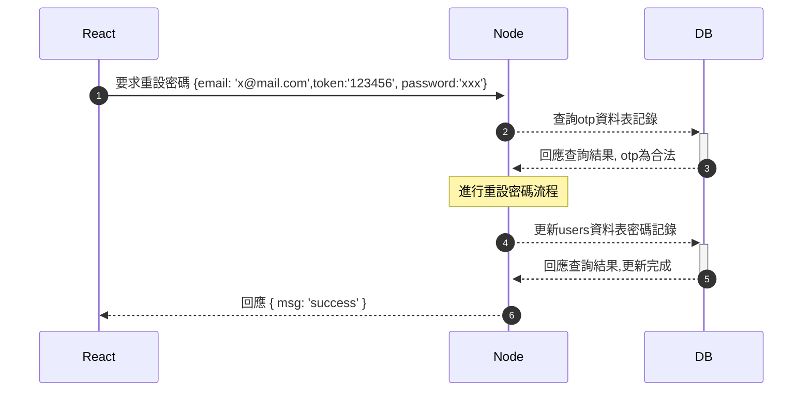

# OTP (one time password)

## 展示畫面

> 套用說明見本文[最下面的套用說明](https://github.com/mfee-react/express-base-esm/blob/main/docs/otp.md#%E5%A5%97%E7%94%A8%E8%AA%AA%E6%98%8E)

## 說明事項

使用[otpauth](https://www.npmjs.com/package/otpauth)的 TOTP 與預設選項(30s step)。相關技術參考: , [TOTP維基百科中文](https://zh.wikipedia.org/zh-tw/%E5%9F%BA%E4%BA%8E%E6%97%B6%E9%97%B4%E7%9A%84%E4%B8%80%E6%AC%A1%E6%80%A7%E5%AF%86%E7%A0%81%E7%AE%97%E6%B3%95), [RFC6238](https://datatracker.ietf.org/doc/html/rfc6238)

規則:

- 每60秒才能重傳一組新驗証碼到Email(伺服器會檢查+網頁上會倒數秒數)。
- 電子郵件驗証碼的過期時間預設為30分鐘(在Node中的createOtp設定)，使用資料庫欄位比對時間。
- 逾期或失敗重傳，需要至少60s，在Node與資料庫欄位也有檢查。
- 除上述外，其它安全機制沒實作。

補充: 

如果需要分離式的流程要額外設計，例如`第1頁填email 第2頁再填otp 第3頁再填新密碼`的流程，不同頁面間需要一些機制(如session)來作好安全防範

## 工作流程(Workflow)

### 說明

1. 使用者在`忘記密碼頁面`，輸入Email後，發送`取得驗証碼`要求
2. 伺服器產生otp後，記錄到資料庫中，寄送otp(6位數字，例如`550093`)到Email中
3. 使用者接收到Email後，將otp填入`電子郵件驗証碼`中，之後設定新密碼，按下確定送到伺服器
4. 伺服器確認資料庫記錄，驗証otp合法性，合法的話就進行資料庫中使用者對應的Email資料的新密碼重新設定

### 網頁(忘記密碼頁面)示意圖

### 客戶端流程圖

### 時序圖 (Sequence diagram) 

> 註: 以下 React(Next/客戶端/瀏覽器端), Node(伺服器端), DB(資料庫), SMTP(寄email伺服器)

#### 要求OTP流程

> 註: 因為會有"失敗/逾時"需重新產生OTP記錄情況，產生OTP前應需判斷是否是這情況

#### 重設密碼+驗証OTP流程

> 註: 此處的驗証otp流程也可以先獨立驗証，驗証完成再進行重設密碼，但可能需要額外的session機制搭配

## 套用說明

1. 向外寄信(SMTP功能)要先設定好: 參考[(2023年7月) Node + Google SMTP發送電子郵件](https://github.com/mfee-react/express-base-esm/blob/main/docs/smtp.md)
2. 建立otp資料表: MySQL資料表([repo](https://github.com/mfee-react/express-base-esm/blob/main/data/otp.sql)): `data/otp.sql`
3. 瀏覽器(客戶)端(React): [repo](https://github.com/mfee-react/next-bs5/blob/main/pages/user-test/forget-password.js))，範例上路由是用 `/user-test/forget-password`

其它:

- next(react)頁面有用到一個倒數計數的勾子[useInterval](https://github.com/mfee-react/next-bs5/blob/main/hooks/use-interval.js)，只是簡單展示在畫面上倒數60秒
- express中的OTP設定是[config
/otp.js](https://github.com/mfee-react/express-base-esm/blob/main/config/otp.js)，資料表各種處理查詢用是在[models/otp.js](https://github.com/mfee-react/express-base-esm/blob/main/models/otp.js)與路由是在[routes
/reset-password.js](https://github.com/mfee-react/express-base-esm/blob/main/routes/reset-password.js)可能會需要依你的資料表欄位、資料表名稱、路由...etc修改

