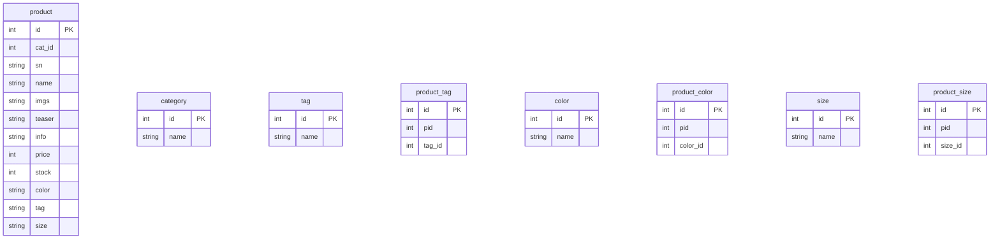

# 商品過濾範例

## 展示


## 說明

本範例中包含了以下實作:

- 商品關鍵字
- 商品分類(1個)
- 商品顏色、標籤、尺寸(1至多)
- 價格區間(最小、最大)
- 排序(id小至大、id大至小、價格低到高、價格高到低)
- 分頁

## 建立測試環境

### 第一步: 建立範例資料

設定好`express-base-esm`中的資料庫帳號、密碼、資料庫等資訊，如果有必要請再執行一次`npm i`，安裝所需的套件:

> .env

```text
DB_HOST=127.0.0.1
DB_PORT=3306
DB_DATABASE=test
DB_USERNAME=root
DB_PASSWORD=12345
```

在終端機中用node先直接執行，建立大量範例資料:

```sh
node  ./utils/create-sample.js
```

上面指令執行後，會產生1k的範例資料，可依需求調整`createFakeProduct`函式中的範例資料格式，與建立更多資料(5k, 10k)，太多可能要分次執行函式。

> 注意: 每次執行都會先刪除、再填入`product`, `tag`, `color`, `size`, `product_tag`, `product_color`, `product_size`這7個資料表的資料，如果你有使用同名的資料庫記得先備份，或在不同的資料庫中執行範例。

> 注意: 在`create-sample.js`檔案中的`createProducts`函式中的`await writeJsonFile(...)`可以在執行後，建立一個json範例檔案，但如果檔案過大可能無法使用(用於前端開發測試用)，目前是註解掉不產生json檔案，如有需要可以再建立。

### 第二步: 與目前的 next-bs5 互相進行操作

執行`express-base-esm`，它預設是運行在`http://localhost:3005`

```sh
npm start
```

執行next-bs5

```sh
npm run dev
```

在瀏覽器打開`http://localhost:3000/product-test/list`，這個範例是只有使用react的狀態來操控伺服器的過濾查詢。

在瀏覽器打開`http://localhost:3000/product-test/list-query`，這個範例是使用router中的query(即網址上的查詢字串)，連動react的狀態來操控伺服器的過濾查詢。

在postman(或其它restful客戶端)中，輸入以下的網址來測試GET，應可以看到從伺服器傳回的結果:

```sh
http://localhost:3005/api/products/qs?page=1&orderby=price,desc&perpage=10&cat_ids=1,2&tags=1,2&colors=3,4&sizes=1,2&keyword=衣
```

## 資料庫設計

商品過濾查詢功能的實作中，最難的實作點在於資料庫的設計，以及資料庫的查詢。先討論這部份，其它的實作都是以這為出發跟著套用。

在這範例中的ER模型，以及資料表如下的設計。

### ER Model


- 每個商品只屬於一種分類: category {1}–{1..n} product
- 每個商品會有至少一個到多個標籤: product {1}–{1..n} tag
- 每個商品會有至少一個到多個顏色: product {1}–{1..n} color
- 每個商品會有至少一個到多個尺寸: product {1}–{1..n} size

### 資料表



### SQL實作範例

> 註: 在這範例中，用`JOIN`(相當於`INNER JOIN`), `INNER JOIN`, `LEFT JOIN`是同樣結果，因為所有的商品都至少會對應到一個color, tag, size

例如當有`product`與`color`資料表，要查詢其中包含兩種顏色`黑`與`白`時，SQL如下:

```sql
SELECT p.*,
       GROUP_CONCAT(c.name SEPARATOR ',') AS color_name
FROM product AS p
       INNER JOIN product_color AS pc ON pc.pid = p.id
       INNER JOIN color AS c ON c.id = pc.color_id
WHERE c.name IN ('黑', '白')
GROUP BY p.id;
```

或是子查詢的語法(與上同結果):

```sql
SELECT p.*,
       GROUP_CONCAT(c.name SEPARATOR ',') color_name
FROM product AS p
       INNER JOIN product_color AS pc ON pc.pid = p.id
       INNER JOIN (
              SELECT *
              FROM color
              WHERE color.name = '白'
                     OR color.name = '黑'
       ) AS c ON c.id = pc.color_id
GROUP BY p.id;
```

---

例如，再加上分類的查詢後，又需要多了分類篩選的條件:

```sql
SELECT p.*,
       GROUP_CONCAT(c.name SEPARATOR ',') color_name
FROM product AS p
       INNER JOIN product_color AS pc ON pc.pid = p.id
       INNER JOIN color AS c ON c.id = pc.color_id
WHERE p.cat_id IN (1, 2)
       AND c.name IN ('黑', '白')
GROUP BY p.id;
```

---

如果又加上對商品名稱的查詢、標籤、尺寸的與顏色相同的查詢，以及排序、分頁，再作對這幾個表的多表聯集操作:

```sql
SELECT p.*,
       GROUP_CONCAT(DISTINCT c.name SEPARATOR ',') AS color_name,
       GROUP_CONCAT(DISTINCT t.name SEPARATOR ',') AS tag_name,
       GROUP_CONCAT(DISTINCT s.name SEPARATOR ',') AS size_name
FROM product AS p
       INNER JOIN product_color AS pc ON pc.pid = p.id
       INNER JOIN color AS c ON c.id = pc.color_id
       INNER JOIN product_tag AS pt ON pt.pid = p.id
       INNER JOIN tag AS t ON t.id = pt.tag_id
       INNER JOIN product_size AS ps ON ps.pid = p.id
       INNER JOIN size AS s ON s.id = ps.size_id
WHERE p.name LIKE '%衣%'
       AND p.cat_id IN (1, 2)
       AND c.name IN ('黑', '白')
       AND t.name IN ('中性', '男性')
       AND s.name IN ('S', 'M')
       AND p.price BETWEEN 2000 AND 8000
GROUP BY p.id
ORDER BY p.price DESC
LIMIT 10 OFFSET 0;
```

實作時，除了關鍵字外，其它的像分類或顏色、標籤、尺寸等等，都會用用id加入在查詢字串來傳遞到API路由中，所以最後會是像下面的SQL:

> 註: 使用id的原因第一是要讓網址較為簡短易用，如果用字串傳遞會讓查詢字串變得較長。第二是多國語言化問題，它會變得不易進行多國語言化。id本身都是資料表索引沒錯，按理說能提升一些效率，但因為目前被查詢的整個資料集合很小，並沒有什麼大影響，可以視為先忽略。


```sql
SELECT p.*,
       GROUP_CONCAT(DISTINCT c.name SEPARATOR ',') AS color_name,
       GROUP_CONCAT(DISTINCT t.name SEPARATOR ',') AS tag_name,
       GROUP_CONCAT(DISTINCT s.name SEPARATOR ',') AS size_name
FROM product AS p
       INNER JOIN product_color AS pc ON pc.pid = p.id
       INNER JOIN color AS c ON c.id = pc.color_id
       INNER JOIN product_tag AS pt ON pt.pid = p.id
       INNER JOIN tag AS t ON t.id = pt.tag_id
       INNER JOIN product_size AS ps ON ps.pid = p.id
       INNER JOIN size AS s ON s.id = ps.size_id
WHERE p.name LIKE '%衣%'
       AND p.cat_id IN (1, 2)
       AND c.id IN (1,2)
       AND t.id IN (1,3)
       AND s.id IN (1,2)
       AND p.price BETWEEN 2000 AND 8000
GROUP BY p.id
ORDER BY p.price DESC
LIMIT 10 OFFSET 0;
```

---

完成SQL在資料庫的測試後，剩下的就是Node(express)中，從req.query中傳來的網址查詢字串，解析後轉為SQL，向資料庫查詢結果的實作，這部份可以參考`express-base-esm`的`routes/products.js`關於`router.get('/qs'...)`的實作，就不再多說明。

### SQL查詢效能最佳化

本章節只說明了簡單的SQL查詢最佳化方式，而且是特別針對MySQL而言。

在上面章節裡的最後，有個稍微繁多些SQL查詢中，或許它並不能完全滿足在商品的各種查詢，目前的範例只有對幾個表的過濾或篩選機制，在更複雜的(或實務上)要和更多資料表交互查詢應用，例如以下幾個:

- 顧客與商品間的最愛(或收藏) - 顧客可以收藏(加入我的最愛)商品，一樣要在商品列表中呈現(例如愛心圖示)
- 商品的評分加總，或幾則評論，或熱門點選的計數 - 顧客對於商品的評分，要加總計算一樣要在列表中呈現

另外，目前在上一章節的SQL，它的效能在商品數量不多時(1k以下)，尚且還行，但當商品到達10k時，就會開始變慢，以下是在個人電腦上以MySQL v8.0的測試結果:(以`product`資料量為主，5次執行結果，執行時間單位為`ms`)

- 1K - 11, 13, 10, 12, 11
- 10k - 107,111, 142, 109, 106
- 50k - 422, 403, 423, 407, 421

執行效能是一個線性成長的，在50k資料量，要執行一次的查詢需要接近半秒(500ms)了，在更多資料時，它就需要更多時間來執行一次。

我們知道伺服器或資料庫是一個需要設計給多人使用的系統，並非服務單人而已，當然伺服器或資料庫有各種分散的、快取的機制可以協助你作這些事。不過先以目前的查詢的角度來看，當一個伺服器(node+mysql)不斷地被很多使用者，同時地查詢過濾各種商品列表項目時，這種SQL的時間會因為拖得太長，拖得愈長變得資源會愈受限，變得效率上出現嚴重的問題。所以，以後端或資料庫的角度來說，這是必要改善的。

SQL查詢有很多種不同的語法或作法，都能得到最終同樣的結果。當然課堂上教了不少標準的原則性，但實務上還是得看實際上的執行和需求要調整，尋找最佳的效率和最適合的作法。

這裡提供的改善方向，這裡只是針對目前的查詢工作而言，當然還有很多其它不同角度的作法:

1. 盡可能改為單張資料表的查詢過濾 - 單表查詢永遠比多表有效率
2. 需要查詢的欄位都要索引化 - 這是基本的最佳化

針對第一點，改為單表查詢操作後，它原本就是在產生`product`範例資料庫時，會同步建立的`color`, `tag`, `size`的三個欄位，上面的同結果查詢要改為以下:

```sql
SELECT *
FROM product AS p
WHERE  p.name LIKE '%衣%'
       AND p.cat_id IN (1, 2)
       AND (
              FIND_IN_SET(1, p.color)
              OR FIND_IN_SET(2, p.color)
       )
       AND (FIND_IN_SET(1, p.tag)
            OR FIND_IN_SET(3, p.tag))
       AND (
              FIND_IN_SET(1, p.size)
              OR FIND_IN_SET(2, p.size)
       )
       AND p.price BETWEEN 2000 AND 8000
ORDER BY p.price DESC
LIMIT 10 OFFSET 0;
```

> 註: 這裡要改為`FIND_IN_SET`，而不能使用`IN`作查詢，`IN`無法在被比較集合是某欄位(或變數)作查詢時用

第1點改善後，它的效能提升非常多，是原本多表查詢的5分之1左右的執行時間(以`product`資料量為主，5次執行結果，執行時間單位為`ms`):

- 1K - 7, 5, 4, 5, 4
- 10k - 23, 20, 19, 21, 20
- 50k - 83, 71, 72, 69, 59

第2點，這也是很簡單可行的最佳化，把所有會過濾、搜尋用到的各欄位(cat_id, name, color...)依序都加到索引中:

```sql
ALTER TABLE product ADD INDEX (cat_id);
ALTER TABLE product ADD INDEX (name);
ALTER TABLE product ADD INDEX (color);
ALTER TABLE product ADD INDEX (tag);
ALTER TABLE product ADD INDEX (size);
ALTER TABLE product ADD INDEX (price);
```

之後，再進行50k的資料查詢5次測試(以`product`資料量為主，5次執行結果，執行時間單位為`ms`):

- 50k - 3, 4, 2, 18, 3

那更多資料呢？下面是針對100k資料查詢5次的測試，可以發現索引起了作用，它不會因資料量成長出現線性的執行時間成長。利用索引的各種查詢在MySQL中，可以達成相當的高效的查詢:(以`product`資料量為主，5次執行結果，執行時間單位為`ms`)

- 100k - 9, 3, 5, 4, 6

那如果是原本的多表查詢在100k中，效率會有多差？相比上面，可以說是差到一個不太能使用的程度，除了它是線性成長，而且就算在`product`中索引化也不會提升什麼效能，因為多表查詢原本就是一種高消耗查詢:(以`product`資料量為主，5次執行結果，執行時間單位為`ms`)

- 100k - 1033, 998, 1017, 988, 1006

以上是最簡單的最佳化作法。

---


不過，原本的`product`資料表，在正常的建立下，由於正規化後的關係，它並沒有`color`, `tag`, `size`欄位的，可以額外建立一個專門用於過濾用的資料表，如下面的範例:

```sql
CREATE TABLE product_qs AS (
       SELECT p.*,
              GROUP_CONCAT(
                     DISTINCT c.id
                     ORDER BY c.id ASC SEPARATOR ','
              ) AS color_id,
              GROUP_CONCAT(
                     DISTINCT t.id
                     ORDER BY t.id ASC SEPARATOR ','
              ) AS tag_id,
              GROUP_CONCAT(
                     DISTINCT s.id
                     ORDER BY s.id ASC SEPARATOR ','
              ) AS size_id,
              GROUP_CONCAT(
                     DISTINCT c.name
                     ORDER BY c.id ASC SEPARATOR ','
              ) AS color_name,
              GROUP_CONCAT(
                     DISTINCT t.name
                     ORDER BY t.id ASC SEPARATOR ','
              ) AS tag_name,
              GROUP_CONCAT(
                     DISTINCT s.name
                     ORDER BY s.id ASC SEPARATOR ','
              ) AS size_name
       FROM product AS p
              INNER JOIN product_color AS pc ON pc.pid = p.id
              INNER JOIN color c ON c.id = pc.color_id
              INNER JOIN product_tag AS pt ON pt.pid = p.id
              INNER JOIN tag t ON t.id = pt.tag_id
              INNER JOIN product_size AS ps ON ps.pid = p.id
              INNER JOIN size AS s ON s.id = ps.size_id
       GROUP BY p.id
       ORDER BY p.id
);
ALTER TABLE product_qs ADD PRIMARY KEY(id);
```

其它的麻煩處當然也有，如果你經常性的需要修改`color`, `tag`, `size`表格時，就得又重新產生`product`相對的欄位值，當然這可以是周期性的工作，它可以用`stored procedure`之類的方式來預先產生。

那麼如果你有更多的查詢要作，例如要加上剛所說的使用者與商品間收藏的關係，或是評分加總等等，都可以先建立出這張表，再由這張資料表開始進行。評分加總也可以先作在這張表上，不需要每次作查詢都要加總計算一次，可以提升非常高的效率。

## 網頁應用的查詢過濾設計

### 只依靠react狀態

`product-test/list`範例中，只有使用react的狀態來操控伺服器的過濾查詢。

它的執行順序很單純，都是依靠所有狀態的改變，和node進行資料要求有三個時間點:

- 一開始進入網頁時，向伺服器api路由要所有的資料(不給任何查詢參數)
- 使用者選完各選項後，按下"載入"按鈕後，向伺服器api路由送出帶有查詢字串的參數，重新獲取資料
- 分頁列按下頁數時，也會向伺服器api路由送出帶有查詢字串的參數，重新獲取資料

所有的畫面上的選項都是與某個狀態綁定。執行順序是這樣:


這個流程是一種完全CSR+SPA的設計，可以看到不論你在畫面上改動什麼，網址一樣都不會變化，都是`product-test/list`。

另外頁面只要重新刷新，剛設定的選項就會重置到原本初始的狀態，這當然是因為react的狀態重置了，是自然的行為。

如果你在這種機制下，要記得上次選中的選項，可以另外使用像localStorage或session/cookie的機制來記得，當然這是除非有必要才需要。

### 由網頁查詢字串觸發的設計

`product-test/list-query`，這個範例是使用router中的query(即網址上的查詢字串)，連動react的狀態來操控伺服器的過濾查詢。

情況以下面的流程圖簡單說明如下:

#### 一進入頁面時(didMount)


#### 使用者設置好所有過濾條件後，之後按下"載入"按鈕


#### 使用者按下分頁


#### 說明

這必須要對準時間點來設定，以及向伺服器要求的流程。因為react的狀態要設定回來，和要要求伺服器的時間點是同個時間點，所以不能用像上一節的作法，直接用react的最後更動狀態來向伺服器要求，而是要改用`query`物件中的參數來向伺服器要求。(詳細參考之前課堂中有關於"State的更動是異步"一節說明)

當然router是next提供的一個獲取路由的勾子，雖然叫作跳頁實際上都是還在同頁操作(因為網頁在換頁或query改變重新查詢時，並沒有重新刷新)。

實作上比前一章節的作法較複雜些，但為什麼要用這種在網址上呈現所有查詢字串的作法？其原因有幾個:

1. 方便查詢操作，或連向這頁面的初始化連結: 例如有個可以直接查詢分類id=2的連結，可以直接用`product-test/list-query?cat_id=2`連到這頁，一載入頁面時就會作`cat_id=2`的查詢，以此類推。
2. 保持住使用者查詢的條件: 網址可以加入到瀏覽器中的我的最愛，也可以作瀏覽器向前一頁或向下一頁的操作，當然這意思是每個不同查詢條件代表不同頁面，查詢條件並不會在重新整理後消失。
3. SEO: 可以在網站地圖(sitemap.xml)中，進行各分類或選項的更細部的網址或描述，相較於上一章的同網址的操作來說，更有助於提高SEO。(如果說有各細部連結在選單或某處，也可以讓爬蟲得到一些資料。)

## 結論

有相關問題可以再詢問我(hello@eddychang.me)
