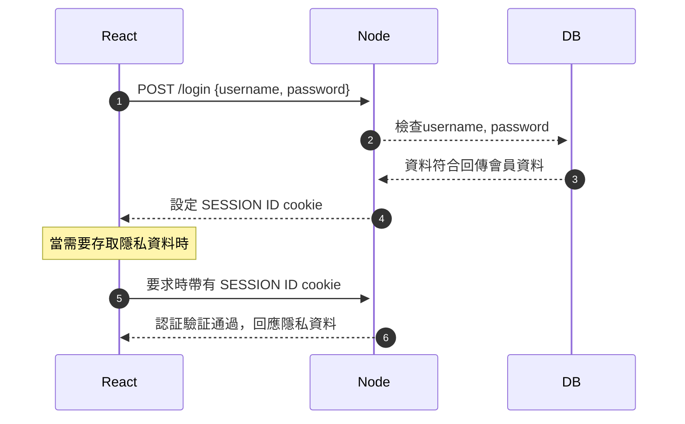
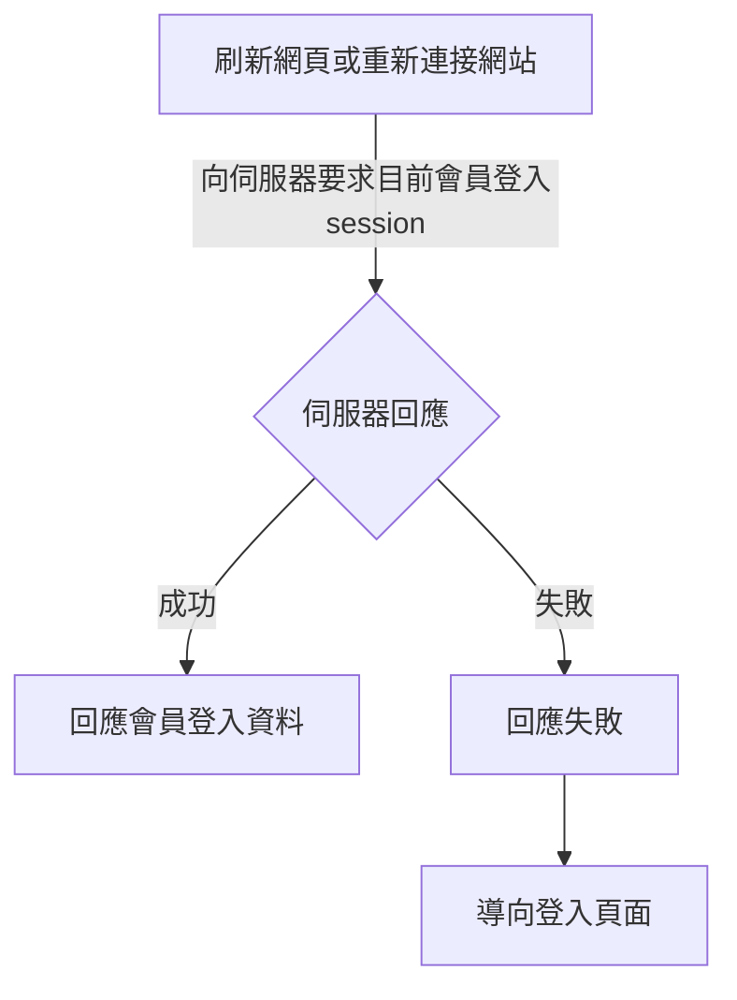

# 會員登入解說 - session-cookie

## session-cookie認証機制

session-cookie機制是最典型的、基本的會員登入機制，實作上相當簡單。它的時序圖如下:




### express應用

express中透過相關套件中的API的使用，就可以達成上面的流程，以下分各程式碼片段解說，詳細設定選項請見各官網文件說明:

```js
// 解析cookie用套件
import cookieParser from 'cookie-parser'
// 導入session中介軟體與設定
const session = require('express-session')
// 使用檔案的session store，存在sessions資料夾
import sessionFileStore from 'session-file-store'
const FileStore = sessionFileStore(session)
//...
app.use(
  session({
    store: new FileStore(fileStoreOptions), // 使用檔案記錄session
    name: 'SESSION_ID', // cookie名稱，儲存在瀏覽器裡
    secret: '67f71af4602195de2450faeb6f8856c0', // 安全字串
    cookie: {
      maxAge: 30 * 86400000, // session保存30天
    },
    resave: false,
    saveUninitialized: false,
  })
)
//...
app.use(cookieParser())
```

> 注意: 上述範例使用了`session-file-store`來儲存session，會自動建立一個sessions資料夾在專案根目錄，如果有使用nodemon需要在`package.json`加上以下設定，以免在產生session又造成nodemon重新啟動node，有時候會造成一些執行錯誤或影響:

```json
  "nodemonConfig": {
    "ignore": [
      "sessions/*",
      "node_modules/*"
    ]
  }
```

當設定完成後，在每個路由進行要求時，就可以從要求(`req`)中得到從瀏覽器中傳來的session值。(精確來說，它是express會比對從瀏覽器中帶有`SESSION_ID`這名稱的cookie，和記錄在伺服器的session檔案，如果有存在則會解析後，加到req物件中)

```js
router.get('/', (req, res) => {
  console.log(req.session)
})
```

另外從瀏覽器(react)中進行fetch時，需要自行設定相關選項，fetch API預設並不會在傳送要求時帶cookie，:

```js
fetch(url, {
  method: 'GET',
  credentials: 'include'
})
.then((response) => response.json())
.then((json) => {})
.catch((err) => {})
```

在作登入的POST時也一樣要加上這個，伺服器才會正確設定cookie。設定`credentials: 'include'`是需要的。

```js
fetch('/login', {
  method: 'POST',
  credentials: 'include',
  headers: {
    'Content-Type': 'application/json'
  },
  body: JSON.stringify({
    name: 'Hubot',
    login: 'hubot',
  })
})
```

如果是使用`axios`來取代`fetch`，則是在送出要求時，加上`withCredentials: true`，例如以下的登入用的程式碼:

```js
const res = await axios.post('http://localhost:3005/api/auth/login',
    {
        username: 'ginny132',
        password: '12345',
    },
    {
        withCredentials: true, // save cookie in browser
    }
)
```

另一個常發生的問題，是在cors設定上。由於next(react，瀏覽器)與express(node)是不同伺服器，所以在作這種有安全性的要求與回應時，瀏覽器都會啟用各種安全機制防止，經常會出現跨網域錯誤。

> 註: 關於cors可以參考MDN文件:[跨來源資源共用CORS](https://developer.mozilla.org/zh-TW/docs/Web/HTTP/CORS)。

這裡給的範例是next(react，瀏覽器)使用`http://localhost:3000`網址的設定，如果你的next(react，瀏覽器)並不是使用這個網址，則可以再修改它。

```js
// 載入所需的cors套件
import cors from 'cors'
// 可以使用的CORS要求，options必要
// app.use(cors())  // 不要用這個，這代表全部允許，但瀏覽器常不能使用
app.use(
  cors({
    origin: ['http://localhost:3000'],
    methods: ['GET', 'POST', 'PUT', 'DELETE'],
    credentials: true,
  })
)
```

登入時，有幾個步驟要登上面的流程來作:

```js
router.post('/login', async function (req, res, next) {
  // 獲得username, password資料
  const user = req.body

  // 這裡可以再檢查從react來的資料，哪些資料為必要(username, password...)
  if (!user.username || !user.password) {
    return res.json({ message: 'fail', code: '400' })
  }

  const { username, password } = user

  // 先查詢資料庫是否有同username/password的資料
  const isMember = await verifyUser({
    username,
    password,
  })

  if (!isMember) {
    return res.json({ message: 'fail', code: '400' })
  }

  // 會員存在，將會員的資料取出
  const member = await getUser({
    username,
    password,
  })

  // 如果沒必要，member的password資料不應該，也不需要回應給瀏覽器
  delete member.password

  // 啟用session
  req.session.userId = member.id

  return res.json({
    message: 'success',
    code: '200',
    user: member,
  })
})
```

登出時，由伺服器來發出清除cookie，以及清除session就完成了:

```js
router.post('/logout', auth, async function (req, res, next) {
  res.clearCookie('SESSION_ID') //cookie name

  req.session.destroy(() => {
    console.log('session destroyed')
  })

  res.json({ message: 'success', code: '200' })
})
```

auth是一個middleware(中介軟體)，用於檢查session屬性名是否存在，如果不存在(或比對錯誤)，就不能存取隱私的資料，這裡程式碼中的`req.session.userId`要對應上面在登入時啟用的(或建立的)seesion屬性名:

> `/middlewares/auth.js`

```js
// 認証用的 middleware
export default function auth(req, res, next) {
  if (req.session.userId) {
    console.log('authenticated')
    next()
  } else {
    console.log('Unauthenticated')
    return res.status(401).json({ message: 'Unauthorized' })
  }
}
```

### Next(react, 瀏覽器)在重新連接網頁時、會員登出入的對應應用

瀏覽器應用程式，在重新刷新網頁、重新連接網頁時，都可以向伺服器要求(詢問)目前會員的登入情況，這可以透過一個簡單的use-auth勾子，在useEffect於didMount(即初次渲染完成後)的時間點，以及搭配express(node, 伺服器)的一個API路由來達成。

簡單的流程圖如下:



express(node, 伺服器)部份的程式碼範例:

> routes/auth.js

```js
router.get('/check-login', async function (req, res, next) {
  if (req.session.userId) {
    const userId = req.session.userId
    // 這裡可以直接查詢會員資料一並送出
    const member = await getUserById(userId)
    // 如果沒必要，user的password資料不應該，也不需要回應給瀏覽器
    delete member.password

    return res.json({ message: 'authorized', user: member })
  } else {
    return res.json({ message: 'Unauthorized' })
  }
})
```

`useAuth`勾子的完整程式碼如下(next中)，這勾子程式碼並沒有很多，它只負責上面說的重新整理和重連上網站時的流程:

> 註: 因為在`auth`狀態共享到全站後，登入與登出的行為，只會和`useAuth`勾子的狀態有關，實際上登出和登入函式也可以都寫在`useAuth`中，再加入Context中傳出使用，本教學並沒有這樣作。

- 程式碼在: [hooks/use-auth.js](https://github.com/mfee-react/next-bs5/blob/main/hooks/use-auth.js)


`AuthProvider`一樣需要加到`_app.js`中，它是全站分享的會員登入狀態Context:

```js
import { AuthProvider } from '@/hooks/use-auth'
//...
export default function MyApp({ Component, pageProps }) {
  //...
 return (
    <AuthProvider>
      <CartProvider>{getLayout(<Component {...pageProps} />)}</CartProvider>
    </AuthProvider>
  )
}
```

當需要使用auth狀態時，直接導入後解構就可以得到，例如下面的程式碼:

> pages/user-test/login-status.js

```js
import { useAuth } from '@/hooks/use-auth'
// ...
export default function LoginStatus() {
 const { auth } = useAuth()
 // ...
 return <p>會員姓名:{auth.userData.name}</p>
}
```

`useAuth`勾子在didMount(初次渲染之後)，向伺服器要求檢查的功能，但它只負責這功能而已。

因此在使用者進行登出與登入時，它是不知道的，所以要利用它共享的`setAuth`方法進行設定，如下的範例:

> pages/user-test/index.js (登入時)

```js
const res = await axios.post(
  'http://localhost:3005/api/auth/login',
  {
    username: 'ginny132',
    password: '12345',
  },
  {
    withCredentials: true, // save cookie in browser
  }
)

console.log(res.data)

if (res.data.message === 'success' && res.data.user.id) {
  setAuth({
    isAuth: true,
    userData: res.data.user,
  })
}
```

> pages/user-test/index.js (登出時)

```js
const res = await axios.post(
    'http://localhost:3005/api/auth/logout',
    {},
    {
      withCredentials: true, // save cookie in browser
    }
  )

  if (res.data.message === 'success') {
    setAuth({
      isAuth: false,
      userData: {
        id: 0,
        name: '',
        username: '',
        r_date: '',
      },
    })
  }
```

最後，這裡展示了簡單的，應用`useAuth`與`useRouter`來作隱私路由(會員專屬或登入後才能看到的頁面)的作法。

> pages/user-test/login-status.js

```js
import { useEffect } from 'react'
import { useAuth } from '@/hooks/use-auth'
import Link from 'next/link'
import { useRouter } from 'next/router'

export default function LoginStatus() {
  const { auth } = useAuth()
  const router = useRouter()

  // 未登入時，要導向會員登入頁面
  // 因router有水化合作用，isReady要為true可以使用導向的api
  useEffect(() => {
    if (!auth.isAuth && router.isReady) {
      router.push('/user-test/')
    }
    // eslint-disable-next-line
  }, [router.isReady])

  // 未登入時，不會出現頁面內容
  if (!auth.isAuth) return <></>

  return (
    <>
      <h1>會員專用頁面(未登入無法觀看)</h1>
      <p>會員姓名:{auth.userData.name}</p>
      <Link href="/user-test/">Session-cookie登入測試</Link>
    </>
  )
}
```

有許多同學會有疑問，這樣在初次渲染後(實際上router要能用導向到別的網頁至少還有一次渲染後了)，才能決定會員是否登入，然後再作重新導向，或是呈現不同訊息的作法，在安全性上是否有所不足？或是有辨法在頁面從伺服器一被瀏覽器要求還沒呈現時就能決定是不是隱私路由(或保護路由)了？

答案是目前以CSR(即react)或是原本JavaScript的執行方式，是作不到的，要使用SSR技術，或伺服器端來作這件工作才能達成。換句話說，必需要由伺服器端早先一步，先決定會員有無登入狀態時，該傳送什麼頁面給瀏覽器才行。

> 註: 例如在next裡需要透過專門的套件(如[next-auth](https://github.com/nextauthjs/next-auth))，或是它的SSR中的中介軟體功能來達成。

不過，這裡解說的搭配應用，它也是其中一種可行的樣式。在安全性上，並沒有太大問題，原因是在瀏覽器上呈現的內容，如果是敏感性(隱密性)的，會員才能見到的資料，也是都需要透過伺服器(或加上資料庫)而來，在前面的實作中，如果你有在node(express)中使用了auth中介軟體(middleware)，來保護了這幾個只能由登入後才看能到的路由，這代表就算在瀏覽器能見到這些頁面，也只是一個空殼子或空架子的感覺，不會有可以見到的隱私資料。
