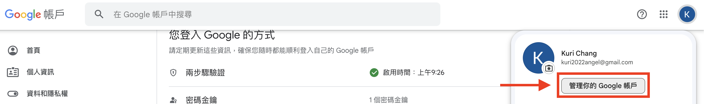
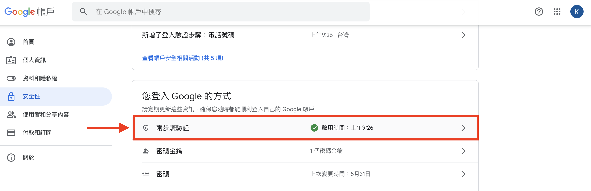
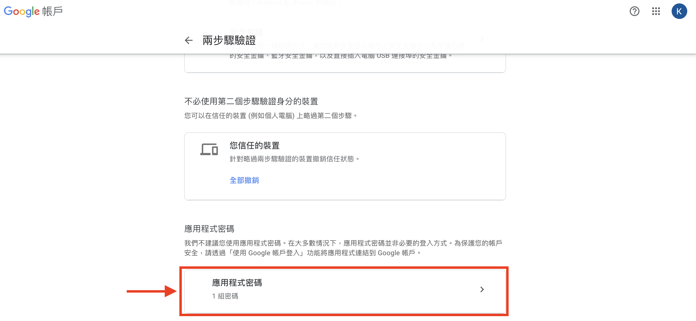
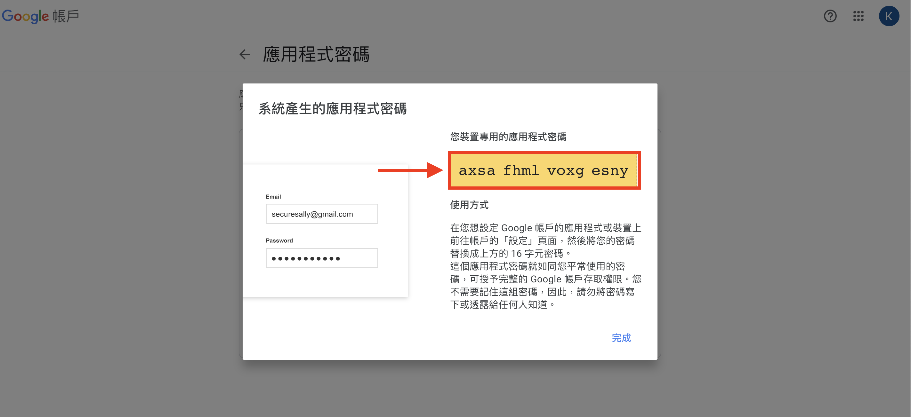
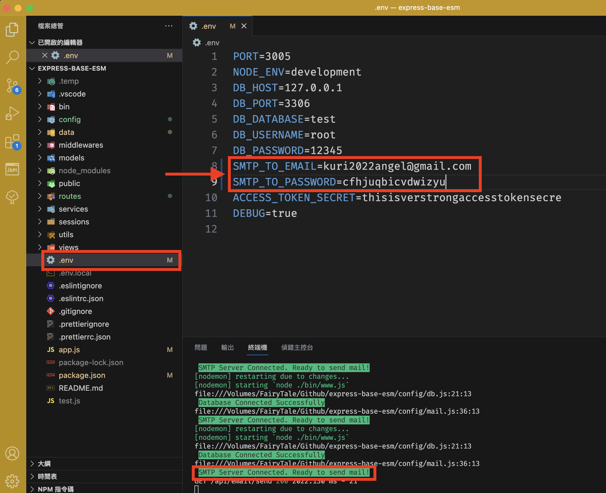
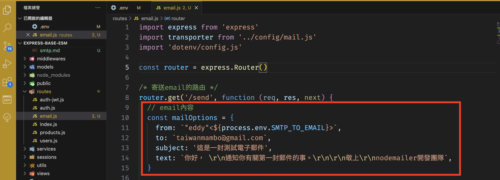
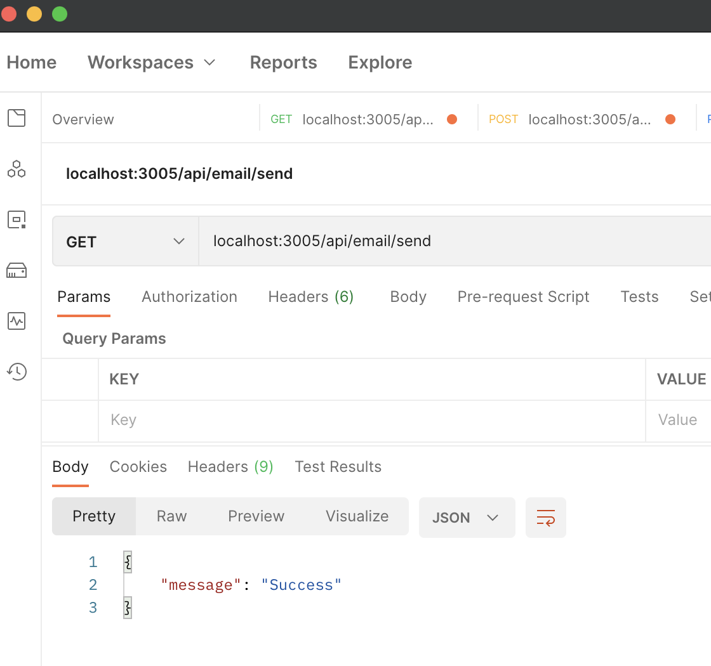
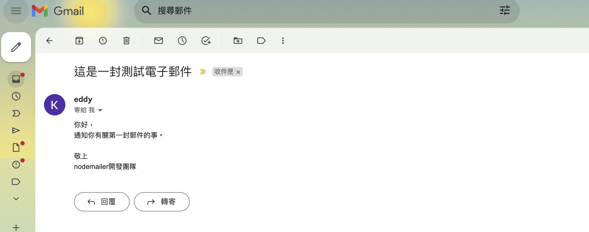

# (2023年7月) Node + Google SMTP發送電子郵件

## 圖解說明

登入gmail帳號後在"**管理你的Google帳戶**"裡的"**安全性**"

1。‼️必要‼️ 要先啟用兩步驟驗証(例如使用手機接收簡訊傳6位密碼…)，此步驟本圖解略過，或參考網路上的其它說明:

- [Google官網說明](https://support.google.com/google-ads/answer/12864186?hl=zh-Hant)

2。兩步驟驗証啟用成功後，點入兩步驟驗証裡面的內容，點入"應用程式密碼"

3。會有兩個選項，可以自訂選一選或填隨便資料後，按右下角"產生"按鈕後，之後產生一組雜湊密碼(圖上黃色背景條這個)，記得要複製出來，因為只能在這看一次，之後無法再讀取到。

4。複製剛的雜湊密碼(上圖黃色背景條那個)，和申請用的Gmail帳號，到專案中根目錄的`.env`檔案裡，裡面的`SMTP_TO_EMAIL`和`SMTP_TO_PASSWORD`，一個貼上email另個是密碼，貼入後啟動node(express)後，會看到有`SMTP Server Connected. Ready to send mail!`，代表已經驗証成功，可以開始寄信了。

5。要寄送的email內容寫在`/routes/email.js`裡，自行定義要寄送的如標題(subject)或內容(text)，預設是純文字內容。

6。測試發送，這專案設定的路由是`localhost:3005/api/email/send`

7。測試是否有收到email的畫面

## 其它

- [nodemailer官網](https://nodemailer.com/about/)
- [寄送HTML格式電子郵件](https://github.com/orgs/mfee-react/discussions/59#discussioncomment-4821575)
- [nodemailer範例](https://github.com/orgs/mfee-react/discussions/59)

## 參考

- [【2021最新版】如何使用Google SMTP寄信(兩段式驗證+應用程式密碼) - 主機架站寄信教學](https://www.webdesigntooler.com/google-smtp-send-mail)
- https://dev.to/viktoriabors/setting-up-nodemailer-with-gmail-after-2022-may-55af
- https://stackoverflow.com/questions/71477637/nodemailer-and-gmail-after-may-30-2022
- https://stackoverflow.com/questions/19877246/nodemailer-with-gmail-and-nodejs